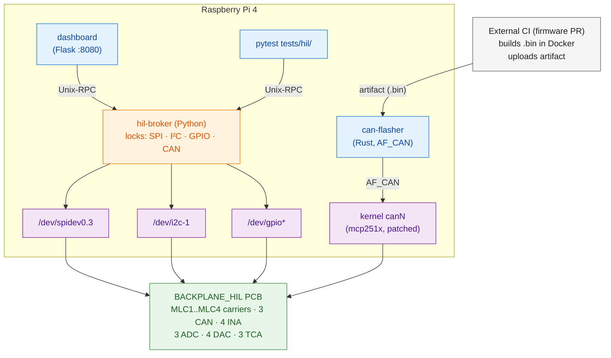

# Claude operating model — IFS08_HIL

You are working on the **IFS08_HIL** Hardware-in-the-Loop testbench for
ISC Racing Team's Formula Student STM32 ECU suite. This file is the
fast-path mental model for an assistant entering a new session. It is
**operational, not architectural** — for the why, follow the file
pointers below.

Author: Raul Moran (ISC Racing Team). Repo:
[`isc-fs/IFS08_HIL`](https://github.com/isc-fs/IFS08_HIL), working
branch `dev`.

---

## How to use this file

1. Read this whole document before suggesting anything substantive.
2. When the user asks you to do X, scan the **Translation table** at
   the bottom — odds are X is listed.
3. When you need detail beyond this file, follow the **Canonical
   sources** pointers — do not re-derive from code.
4. Update this file when something here turns out to be wrong, or
   when a new operational pattern is established (PR a change to it).

---

## Branch policy (READ THIS BEFORE ANY GIT OPERATION)

- **`dev` is the integration branch.** It receives all merged work
  via PR. Do **not** commit directly to `dev` — branch off it
  first, even for small changes (typo fixes, doc tweaks, etc.).
- **`main` is release-only.** Never push to `main` directly, never
  rebase it, never merge into it without explicit user request. The
  release path is `dev` → tag/PR into `main`, and Raul drives it.
- **`jb` is off-limits.** Do not check it out, rebase against it,
  cherry-pick from it, or include it in any operation. If a tool
  call would touch `jb`, stop and ask.
- **Work happens on feature branches off `dev`:**
  - `feat/<short-slug>` for new functionality
  - `fix/<short-slug>` for bug fixes
  - `docs/<short-slug>` for documentation
  - `chore/<short-slug>` for tooling/infra
  - `test/<short-slug>` for test-only changes
- **Every merge into `dev` goes through a PR.** Never `git merge`
  or `git push origin dev` directly. Open a PR on GitHub, let CI
  run, and Raul reviews/merges (or you do, once approved).
- When unsure which branch you're on: `git branch --show-current`.
  If you'd be operating on `main`, `jb`, or directly on `dev`,
  stop.

---

## Commit / push / PR policy

- **Commit freely** on any feature branch (`feat/*`, `fix/*`,
  `docs/*`, `chore/*`, `test/*`) without asking. This overrides
  Claude Code's default "ask before committing" behaviour.
- **Never commit directly to `dev`.** If you find yourself on `dev`
  with changes, branch off first (`git checkout -b <type>/<slug>`)
  and commit there.
- **Branch restrictions are absolute** — no commits/merges/pushes
  to `main` or `jb`, ever, without explicit request.
- **Auto-push for `feat/*` and `fix/*` branches.** As soon as you
  have one or more commits on a `feat/*` or `fix/*` branch ready
  for review, push (`git push -u origin <branch>`) without asking.
- **For other branch types (`docs/*`, `chore/*`, `test/*`)**, push
  when it's the obvious next step — opening a PR, sharing for
  review, or the user asks. No explicit confirmation needed if
  the path is clear; ask if it isn't.
- **Always open a PR to merge into `dev`.** Never `git push origin
  dev` directly, never local-merge into `dev`. Use `gh pr create
  --base dev`. The PR target is always `dev` (never `main`).
- **Don't sweep unrelated changes into a commit.** Stage by file
  (`git add path/to/file`), not `git add -A` or `git add .`. Leave
  untracked work-in-progress that isn't yours (analysis scripts,
  screenshots, scratch dirs) alone.
- **Follow the repo's conventional-commit style** —
  `type(scope): description` where `type` is `feat`, `fix`, `docs`,
  `chore`, `test`, `refactor`, etc. Run `git log --oneline -20` to
  confirm style before authoring unusual messages.
- **No AI co-author or generation trailers.** Do **not** append
  `Co-Authored-By: Claude …` (or any AI co-author line) to commit
  messages, and do **not** add `🤖 Generated with Claude Code`
  footers to PR descriptions. Raul is the sole author. This
  overrides Claude Code's default commit-trailer behaviour.
- **One logical change per commit.** If you've touched two
  unrelated things, that's two commits (or two branches + two PRs
  if the changes don't belong in the same PR).
- **PR title** follows the same conventional-commit style.
  **PR body** summarises the change (1–3 bullets) and a short
  test plan checklist — no generation footers.

---

## The bench in 30 seconds

A Raspberry Pi 4 plugs into the **BACKPLANE_HIL** PCB. The backplane
hosts 4 MLC carrier slots (STM32H733ZG daughterboards), 3 CAN
channels, 4 INA226 current monitors (one per slot), 4 DAC80504s, 3
MCP3208s, 3 TCA9555 I/O expanders, and an ATX PSU interface. Firmware
PRs trigger CI to build a `.bin`, flash it over CAN via the
`can-flasher` Rust binary, and post 🟢/🔴 back to the PR. A Python
daemon — **`hil-broker`** — is the *only* process that opens
`/dev/spidev0.3`, `/dev/i2c-1`, and `/dev/gpio*`; the dashboard and
pytest both go through it via Unix-socket JSON-RPC.

---

## Canonical sources (read these before deep work)

| Question | File |
|---|---|
| What's the bench architecture? | [`docs/architecture.md`](docs/architecture.md) |
| What pin / address / netdev does X live on? | [`docs/hardware-reference.md`](docs/hardware-reference.md) |
| What does broker RPC `Y` do? | [`docs/broker-api.md`](docs/broker-api.md) |
| Day-to-day operator recipes | [`docs/operator-guide.md`](docs/operator-guide.md) |
| Fresh-Pi bringup | [`docs/getting-started.md`](docs/getting-started.md) |
| Something broke | [`docs/troubleshooting.md`](docs/troubleshooting.md) |
| HTTP API for the dashboard | [`docs/dashboard.md`](docs/dashboard.md) |
| Why mcp251x is patched (5 patches) | [`docs/design/mcp251x-driver-patches.md`](docs/design/mcp251x-driver-patches.md) |
| How we got here (PR-by-PR) | [`docs/design/phase-history.md`](docs/design/phase-history.md) |
| Pin/address single source of truth (CODE) | [`tools/hw_config.py`](tools/hw_config.py) |
| KiCad project (gitignored, lives at) | `docs/BACKPLANE_HIL/` |
| PCB design review summary | [`docs/BACKPLANE_HIL/design_review.md`](docs/BACKPLANE_HIL/design_review.md) |
| Production BOM | [`docs/BACKPLANE_HIL/production/bom.csv`](docs/BACKPLANE_HIL/production/bom.csv) |

If `tools/hw_config.py` and a doc disagree, **trust `hw_config.py`**.

---

## Layered picture



---

## The six hard invariants

Break these and things go weird in non-obvious ways.

1. **The broker is the only opener of `/dev/spidev0.3`, `/dev/i2c-1`,
   and `/dev/gpiochip0`.** Scripts and tests use
   `tools.hil_client.*` proxies or `broker.server.BrokerClient`.
   Direct `/dev/*` access from anywhere else risks bus corruption
   under load.

2. **Kernel `mcp251x` owns `/dev/spidev0.{0,1,2}`.** Do not open
   them. They don't exist while the overlay is loaded; trying to
   "fix" that breaks CAN.

3. **CAN netdev names are inverted vs PCB silk.** This is the #1
   source of "discover returns empty" mistakes:

   | kernel | PCB label | who lives there |
   |---|---|---|
   | `can0` | CAN3 (U21) | spare |
   | `can1` | CAN2 (U19) | spare |
   | `can2` | **CAN1 (U17)** | **the MLC carriers — flash here** |

   Every carrier flash command targets `can2`. Always. Do not
   "fix" this in software — the overlay's `reg` ordering is a
   property of the kernel's probe order on this board.

4. **Firmware `gpio=7=op,dl` must be in `/boot/firmware/config.txt`.**
   Without it, the kernel probes `mcp251x` before PSU is on and the
   probe fails with `-110`. `hil-psu-on.service` is belt-and-braces,
   not a substitute.

5. **`txqueuelen=1000` on `canN` is mandatory.** Default 10 returns
   ENOBUFS mid-flash. `hil-can-up.service` sets it; if you find
   yourself running `ip link set canN …` manually, include
   `txqueuelen 1000`.

6. **SPI peripherals are dead until PSU is on (hardware-gated).**
   IC1 (SN74LVC125A) `~OE` is pulled low by Q5 only when ATX
   `PWR_OK` is HIGH. So *any* SPI op presupposes
   `psu.status()['pwr_ok'] == True`. The broker defers DAC
   construction until first DAC call for exactly this reason.

---

## Bench preflight (run these before any session)

```sh
pi$ systemctl is-active hil-psu-on hil-can-up hil-broker   # → active × 3
pi$ ip -br link | grep can                                 # can0/can1/can2 UP
pi$ ls /dev/spidev0.3 /dev/i2c-1                           # both exist
pi$ pinctrl get 7 8                                        # 7=op lo, 8=ip hi
pi$ curl -s -o /dev/null -w '%{http_code}\n' \
        http://localhost:8080/api/status                   # 200
```

All five pass = healthy. Any failure → [`docs/troubleshooting.md`](docs/troubleshooting.md).

---

## Operational recipes (concrete commands)

### Service control

```sh
# Cold start
sudo systemctl start hil-psu-on hil-can-up hil-broker

# Clean stop
sudo systemctl stop hil-broker hil-can-up hil-psu-on

# Restart broker (after editing broker code)
sudo systemctl restart hil-broker

# Logs
journalctl -u hil-broker -f
journalctl -u hil-can-up -b
```

Dashboard runs as `hil-dashboard.service` (broker client, port 8080):
```sh
systemctl status hil-dashboard
sudo systemctl restart hil-dashboard
journalctl -u hil-dashboard -f
```
For ad-hoc runs (different port, debugging), stop the service first
to free 8080, then `python3 dashboard/app.py --port <n>`.

### Power a carrier (MLC slot)

K1/K2/K3/K4 = TCA9555 `0x20` port0 bits 0/1/2/3 → MLC1/MLC2/MLC3/MLC4.
INA226 addresses 0x40/0x41/0x44/0x45.

```python
from broker.server import BrokerClient
c = BrokerClient('/run/hil-broker/broker.sock')

# Energise K1 → MLC1
c.call('tca.set_direction', addr=0x20, port=0, mask=0x00)   # outputs
c.call('tca.write_pin',    addr=0x20, port=0, pin=0, value=True)

# Verify carrier alive
c.call('ina.current', addr=0x40) * 1000   # mA — expect ~130 mA
```

| Reading | Meaning |
|---|---|
| ~130 mA | STM32 bootloader or app running ✓ |
| ≤ 1 mA | Relay didn't close OR carrier fuse blown (F5–F14) |
| Negative | Shunt polarity inverted (shouldn't happen on working board) |
| `bus_voltage_V ≈ 0` | **Normal** (low-side sensing); use `current_A` only |

### Flash an ECU

Single ECU, factory-default node ID:
```sh
can-flasher \
    --interface socketcan --channel can2 --bitrate 500000 \
    --node-id 0x1 --timeout 10000 \
    flash /tmp/firmware.bin \
    --address 0x08020000 --verify-after --jump
```

`--address 0x08020000` = app-image start for STM32H733 +
`isc-fs/stm32-can-bootloader`. After `--jump`, `discover` is silent —
that's success, not failure. Drop app back to BL without touching the
board:
```sh
can-flasher … --node-id 0x1 send-raw 0x001 03 06 01
```

Multiple carriers on the bus → either power one at a time, or
provision distinct node IDs once: `can-flasher … config --set
node-id 0xN`.

### Run tests

```sh
pytest tests/hil/ -v                                # ~93 pass / ~11 skip
pytest tests/hil/test_can.py -v
pytest tests/hil/test_spi_dac.py -k test_channel_sweep
pytest tests/broker/ -v                             # off-bench (fake backend)
```

Tests run **concurrently with the dashboard** — broker serialises
across processes. Auto-skip if broker socket is missing, so off-bench
`pytest tests/` is clean.

### CAN traffic inspection

```sh
candump -t d can2                  # live frames (Ctrl-C to stop)
cansend can2 123#DEADBEEFCAFEBABE  # send one frame
ip -s -d link show can2            # stats + berr-counter (TEC/REC)
```

### Safe shutdown

```sh
sudo systemctl stop hil-broker hil-can-up
sudo systemctl stop hil-psu-on     # ExecStop sets GPIO7 high → PSU off
sudo poweroff
```

(`PS_ON#` also floats on Pi shutdown, so the PSU drops automatically
if you skip the explicit stop.)

---

## Failure → first action

| Symptom | Most likely cause | First action |
|---|---|---|
| `can-flasher discover` empty | Wrong channel, or app already running | Confirm `--channel can2`; `send-raw 0x001 03 06 01` to BL-fy |
| `ENOBUFS (os error 105)` mid-flash | `txqueuelen` not 1000 | `sudo systemctl restart hil-can-up` |
| `RTNETLINK Connection timed out` on `ip link set canN up` | PSU not on / chip asleep | `pinctrl get 7 8` (need `op lo` / `ip hi`) |
| `mcp251x … error -110` at boot | Stock module, or missing `gpio=7=op,dl` | Verify patched module markers; check config.txt |
| Sticky BUS-OFF | `restart-ms 0`, or no peer/bitrate mismatch | `ip -d link show can2`; `systemctl start hil-can-up` |
| Dashboard all red | Broker socket missing | `systemctl status hil-broker` + `journalctl -u hil-broker -b -n 50` |
| `undervoltage detected!` in dmesg | Pi 5 V input weak (ATX 5VSBY < 3 A) | Move Pi to dedicated 5 V / 3 A supply |
| Pytest all skipped | `HIL_BROKER_SOCKET` pointing nowhere | `unset HIL_BROKER_SOCKET`, or set to actual path |
| MLC ≤ 1 mA after relay close | Fuse blown or relay didn't switch | Check F5–F14, listen for relay click, `tca.read_port(0x20, 0)` |
| `Cannot initialize MCP2515. Wrong wiring?` | Patched module not active | `xz -dc /lib/modules/$(uname -r)/.../mcp251x.ko.xz \| strings \| grep backplane_hil` |
| `/dev/spidev0.3` missing | Overlay didn't load | `grep dtoverlay /boot/firmware/config.txt`; `dmesg \| grep overlay` |
| `Address already in use` on 8080 | Stray `nohup` dashboard fighting the service | `pkill -f dashboard/app.py && sudo systemctl restart hil-dashboard` |

Diagnostic capture for help requests:
```sh
sudo dmesg | tail -60 > /tmp/dmesg.txt
journalctl -u hil-psu-on -u hil-can-up -u hil-broker -b --no-pager > /tmp/services.txt
ip -s -d link show can0 can1 can2 > /tmp/can.txt
pinctrl get 4-12 > /tmp/gpio.txt
vcgencmd get_throttled > /tmp/throttle.txt
```

---

## CI flow (firmware-PR loop)

1. Firmware-repo collaborator comments `/hil-build <subdir>` on PR.
2. [`hil-build-trigger.yml`](.github/workflows/hil-build-trigger.yml)
   checks permission, dispatches
   [`hil-build-only.yml`](.github/workflows/hil-build-only.yml) in
   IFS08_HIL with the SHA.
3. Ubuntu runner builds firmware in the `ifs08hil` Docker image
   (Debian-bookworm + arm-gnu-toolchain 12.3.rel1) →
   `.bin`/`.hex`/`SHA256SUMS.txt` → posts ✅/❌ on the firmware PR.
4. On success, [`hil-flash.yml`](.github/workflows/hil-flash.yml)
   runs on the `[self-hosted, hil-rpi]` runner (the bench Pi),
   downloads the artifact, flashes, posts 🟢/🔴.

Bench-side responsibility: keep the broker/can/psu services up and
the GH self-hosted runner installed. The flasher bypasses the broker
(SocketCAN direct).

---

## Known drift / open items

These are tracked imperfections — not bugs you should "fix" on a
whim. Confirm with Raul before touching them.

- **TCA9555 refdes mismatch.** [`tools/hw_config.py`](tools/hw_config.py)
  and [`docs/hardware-reference.md`](docs/hardware-reference.md) name
  the three TCA9555s as U3 / U6 / U8. The production BOM
  ([`docs/BACKPLANE_HIL/production/bom.csv`](docs/BACKPLANE_HIL/production/bom.csv))
  lists U6 / U7 / U8 (and U1–U4 as INA226 ×4). I²C addresses
  (0x20/0x21/0x22 and 0x40/0x41/0x44/0x45) are the authority and
  confirmed by `i2c.scan` — refdes naming is the part that drifted.

- **nRF24 count.** Hardware reference lists U23 (unpopulated). BOM
  lists U22 *and* U23 (`NRF24L01_Breakout` ×2). Either an unpopulated
  spare or a docs lag.

- **CI uses `--channel can0`.**
  [`configs/ecu_*.yaml`](configs/),
  [`configs/hil_agent.yaml`](configs/hil_agent.yaml), and
  [`.github/workflows/hil-flash.yml`](.github/workflows/hil-flash.yml)
  all reference `can0`. But carriers live on `can2`. This is a CI
  bug; manual flashing should always use `can2`. Fix needs:
  YAML updates + hil-flash.yml `--channel` arg + verification that
  `tools/flash.py` (legacy) vs `can-flasher` (current runtime tool)
  story is consistent.

- **`tools/mcp2515.py` and `tools/flash.py` are legacy.** Runtime CAN
  is kernel mcp251x; runtime flasher is the Rust `can-flasher`
  binary. The Python equivalents are kept for historical reference
  only — don't extend them, don't route new code through them.

- **+3V3_pi is "under-decoupled"** per the PCB design review
  (IC1 + nRF24 rail). Cosmetic for now; flagged for the next respin.

---

## Environment quirks

### macOS OneDrive permission

The KiCad project's "official" location is in OneDrive:
`/Users/raulmoran/Library/CloudStorage/OneDrive-UniversidadPontificiaComillas/UNI/ICAI/ISC RACING TEAM/04_2025-2026/PCB_TESTBENCH/PCB_BACKPLANE_HIL/BACKPLANE_HIL/`.
**macOS Privacy & Security blocks shell access to it** (`ls`, `find`,
`Read` all return `Operation not permitted`). Use the in-repo copy
at [`docs/BACKPLANE_HIL/`](docs/BACKPLANE_HIL/) — it's gitignored
(commit `33f29ee`) but present locally. Don't waste cycles trying
to bypass the OneDrive restriction; ask the user to share specific
files if needed.

### Working from a Mac vs from the Pi

Most of this repo runs on the Pi (broker, dashboard, tests, kernel
module, systemd units). Off-bench on a Mac/Linux laptop you can:
- Build/edit code, run `pytest tests/broker/` (fake backend).
- Run `python -m broker.server --fake --socket /tmp/hil-broker.sock`
  + `HIL_BROKER_SOCKET=/tmp/hil-broker.sock pytest tests/hil/` for
  fake-backend integration tests.
- **Cannot** run anything that needs real hardware, mcp251x, or
  `pinctrl`. Tests will skip cleanly.

---

## What NOT to do

- **Don't change the CAN netdev ↔ PCB mapping in software.** It's a
  kernel probe-order property, not a misconfiguration.
- **Don't `psu.power(False)` as a debugging hammer.** Undervoltage,
  BUS-OFF, and stuck mcp251x have cheaper remediations.
- **Don't extend `tools/mcp2515.py` or `tools/flash.py`.** Legacy.
- **Don't add `/dev/spidev*`, `/dev/i2c-*`, or `/dev/gpio*` opens
  outside the broker.** Use `tools.hil_client.*` proxies.
- **Don't commit, merge, rebase, or push to `main`.** Release branch
  only — Raul drives those.
- **Don't touch the `jb` branch at all.** No checkout, no merge, no
  cherry-pick, no rebase against it.
- **Don't skip git hooks with `--no-verify`** or amend pushed
  commits.
- **Don't `git push --force` to any shared branch** (`main`, `dev`,
  `jb`, anything on `origin/`) without explicit user request.
- **Don't run destructive `git` ops** (`reset --hard`, `clean -fd`,
  `checkout .`, `branch -D`) on the user's working tree without
  confirmation.
- **Don't commit `docs/BACKPLANE_HIL/`** — gitignored by design
  (KiCad lock files, autosaves, fp-info-cache, etc.).
- **Don't suggest hardware respins** unless asked — the PCB is
  working.

---

## Translation table (user request → action)

| User says… | You do… |
|---|---|
| "is the bench healthy?" | Run the 5-line preflight (see above). Report which pass/fail. |
| "flash this firmware" | Confirm carrier, INA reads ~130 mA, channel is `can2`, run `can-flasher … flash … --verify-after --jump` |
| "discover doesn't find anything" | Walk: (1) `--channel can2`? (2) carrier powered (INA ~130 mA)? (3) app already running → `send-raw 0x001 03 06 01` |
| "ENOBUFS during flash" | `ip -o link show can2 \| grep qlen` → if 10, `systemctl restart hil-can-up`. Retry flash. |
| "flash hangs / disconnects" | Check `journalctl -u hil-broker -f` + `dmesg -w` + flasher stderr. Often `restart-ms` recovery — retry is safe (verify-after + skip-write). |
| "run the tests" | `cd ~/IFS08_HIL && pytest tests/hil/ -v`. Off-bench: add `--fake` broker + `HIL_BROKER_SOCKET`. |
| "add a new ECU" | Drop a `configs/ecu_<name>.yaml`, ensure CI workflow knows it, ensure carrier slot is assigned. Don't auto-assign — ask Raul. |
| "add a broker RPC method" | Add the backend method to `broker/bus.py` (real) + `broker/fake_bus.py` (fake) → register in `broker/rpc.py` `build_method_table` → add proxy to `tools/hil_client.py` if useful → add `tests/broker/test_*.py` → document in `docs/broker-api.md`. |
| "change a pin/address" | Edit `tools/hw_config.py` **only**. Hardware reference doc auto-becomes-stale; PR the doc update in the same commit. |
| "the dashboard is red" | `systemctl status hil-broker`, `journalctl -u hil-broker -b -n 50`. If broker is down, find why before restarting. |
| "I'm getting undervoltage warnings" | `vcgencmd get_throttled`. If non-zero, the fix is hardware (better 5 V supply on Pi VBUS) — do not patch in software. |
| "deploy a new firmware via CI" | Push to firmware repo, open PR, comment `/hil-build <subdir>`. CI handles the rest. |
| "regenerate fab files" | KiCad work in `docs/BACKPLANE_HIL/`. Outputs in `docs/BACKPLANE_HIL/production/`. PCB is working — confirm scope before regenerating. |
| "review my PR" | Look for: (1) any direct `/dev/*` opens outside broker (NACK); (2) hw_config.py vs docs drift; (3) breaks the 6 invariants? (4) test coverage in `tests/broker/` for new RPCs; (5) sane systemd dependency order. |
| "commit this" / *(after any coherent change)* | If on `dev`, branch off first (`feat/`, `fix/`, `docs/`, etc.). Stage only the relevant files (no `-A`), use conventional-commit style, commit without asking. **Never commit to `main`, `jb`, or directly on `dev`.** |
| *(after committing on `feat/*` or `fix/*`)* | Push automatically (`git push -u origin <branch>`). No need to ask. |
| *(after committing on `docs/*`, `chore/*`, `test/*`)* | Push when opening a PR or when the next step is clearly remote. Otherwise leave it local. |
| "make a PR" / "open a PR" | `gh pr create --base dev` from the feature branch. Title in conventional-commit style; body has 1–3 summary bullets + a short test-plan checklist. PR target is **always** `dev`. |
| "merge into dev" | Open a PR — don't local-merge or direct-push. Raul reviews and merges (or you do once it's approved + green). |
| "push to main" / "merge into main" | Stop and confirm. `main` is release-only; Raul drives it. |
| "what's on `jb`?" | Don't check it out, don't inspect via `git checkout`. If they need info, use `git log origin/jb` read-only — but ask first. |

---

## Style / etiquette

- Communicate in English; user is Spanish-speaking and bilingual,
  prefers English for technical content unless they switch.
- Be concise. Long explanations are noise once context is established.
- When stating a fact about wiring/addresses, cite the source file
  (`hw_config.py:line` or `hardware-reference.md`).
- Prefer minimal diffs. The codebase is intentionally small; don't
  refactor opportunistically.
- Code comments: only when WHY is non-obvious. The codebase follows
  this — match it.
- This is a single-team internal repo. No license/contribution
  banners, no marketing prose in new docs.

---

## Maintaining this file

When something here is wrong or outdated:
1. Edit and PR with a one-line commit message in the project style.
2. If a new operational invariant emerges (e.g. another channel
   inversion, another CI quirk), add it to the **Six hard invariants**
   section.
3. If a translation-table entry is missing, add it — that section is
   the most directly useful part of this file.
4. If you find a drift item, add it to **Known drift / open items**
   rather than fixing silently.
