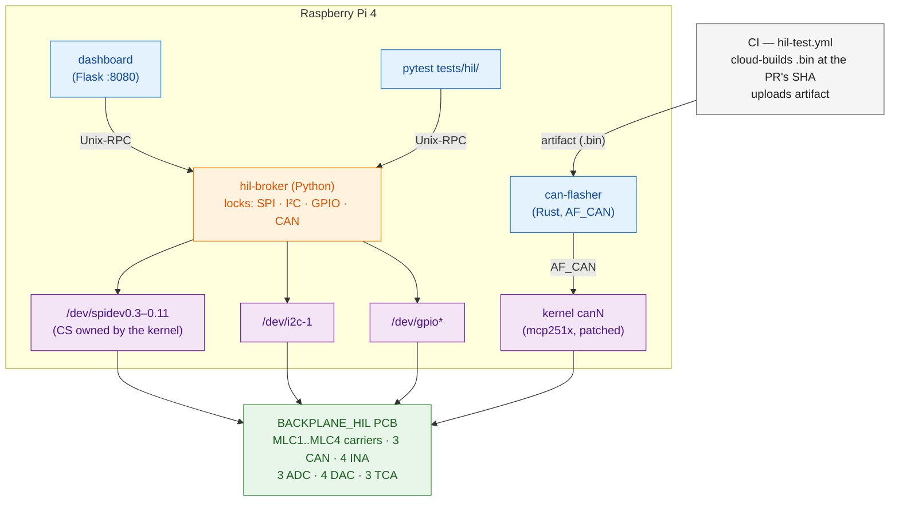

# Claude operating model — IFS_HIL

You are working on the **IFS_HIL** Hardware-in-the-Loop testbench for
ISC Racing Team's Formula Student STM32 ECU suite. This file is the
fast-path mental model for an assistant entering a new session. It is
**operational, not architectural** — for the why, follow the file
pointers below.

Author: Raul Moran (ISC Racing Team). Repo:
[`isc-fs/IFS_HIL`](https://github.com/isc-fs/IFS_HIL), working
branch `dev`.

**New to the project, or taking it over?** Read
[`HANDOVER.md`](HANDOVER.md) first — current state, standing up a new
bench, how CI works, and what is fragile. This file is the day-to-day
cheat-sheet that follows it.

---

## How to use this file

1. Read this whole document before suggesting anything substantive.
2. When the user asks you to do X, scan the **Translation table** at
   the bottom — odds are X is listed.
3. When you need detail beyond this file, follow the **Canonical
   sources** pointers — do not re-derive from code.
4. Update this file when something here turns out to be wrong, or
   when a new operational pattern is established (PR a change to it).

---

## Branch policy (READ THIS BEFORE ANY GIT OPERATION)

- **`dev` is the integration branch.** It receives all merged work
  via PR. Do **not** commit directly to `dev` — branch off it
  first, even for small changes (typo fixes, doc tweaks, etc.).
- **`main` is release-only.** Never push to `main` directly, never
  rebase it, never merge into it without explicit user request. The
  release path is `dev` → tag/PR into `main`, and Raul drives it.
- **`jb` is off-limits.** Do not check it out, rebase against it,
  cherry-pick from it, or include it in any operation. If a tool
  call would touch `jb`, stop and ask.
- **Work happens on feature branches off `dev`:**
  - `feat/<short-slug>` for new functionality
  - `fix/<short-slug>` for bug fixes
  - `docs/<short-slug>` for documentation
  - `chore/<short-slug>` for tooling/infra
  - `test/<short-slug>` for test-only changes
- **Every merge into `dev` goes through a PR.** Never `git merge`
  or `git push origin dev` directly. Open a PR on GitHub, let CI
  run, and Raul reviews/merges (or you do, once approved).
- When unsure which branch you're on: `git branch --show-current`.
  If you'd be operating on `main`, `jb`, or directly on `dev`,
  stop.

---

## Commit / push / PR policy

- **Commit freely** on any feature branch (`feat/*`, `fix/*`,
  `docs/*`, `chore/*`, `test/*`) without asking. This overrides
  Claude Code's default "ask before committing" behaviour.
- **Never commit directly to `dev`.** If you find yourself on `dev`
  with changes, branch off first (`git checkout -b <type>/<slug>`)
  and commit there.
- **Branch restrictions are absolute** — no commits/merges/pushes
  to `main` or `jb`, ever, without explicit request.
- **Auto-push for `feat/*` and `fix/*` branches.** As soon as you
  have one or more commits on a `feat/*` or `fix/*` branch ready
  for review, push (`git push -u origin <branch>`) without asking.
- **For other branch types (`docs/*`, `chore/*`, `test/*`)**, push
  when it's the obvious next step — opening a PR, sharing for
  review, or the user asks. No explicit confirmation needed if
  the path is clear; ask if it isn't.
- **Always open a PR to merge into `dev`.** Never `git push origin
  dev` directly, never local-merge into `dev`. Use `gh pr create
  --base dev`. The PR target is always `dev` (never `main`).
- **Don't sweep unrelated changes into a commit.** Stage by file
  (`git add path/to/file`), not `git add -A` or `git add .`. Leave
  untracked work-in-progress that isn't yours (analysis scripts,
  screenshots, scratch dirs) alone.
- **Follow the repo's conventional-commit style** —
  `type(scope): description` where `type` is `feat`, `fix`, `docs`,
  `chore`, `test`, `refactor`, etc. Run `git log --oneline -20` to
  confirm style before authoring unusual messages.
- **No AI co-author or generation trailers.** Do **not** append
  `Co-Authored-By: Claude …` (or any AI co-author line) to commit
  messages, and do **not** add `🤖 Generated with Claude Code`
  footers to PR descriptions. Raul is the sole author. This
  overrides Claude Code's default commit-trailer behaviour.
- **One logical change per commit.** If you've touched two
  unrelated things, that's two commits (or two branches + two PRs
  if the changes don't belong in the same PR).
- **PR title** follows the same conventional-commit style.
  **PR body** summarises the change (1–3 bullets) and a short
  test plan checklist — no generation footers.

---

## Pi sync workflow (READ BEFORE PUSHING CODE TO THE BENCH)

A bench Pi does **not** carry a git checkout. `~/IFS_HIL/` on the bench
is a non-git working copy maintained by rsync from a developer machine
that does have the git checkout. This avoids storing GitHub credentials
on the bench host and lets you test uncommitted changes against real
hardware before pushing. (The self-hosted CI runner keeps its *own*
checkout under `~/actions-runner/_work/IFS_HIL/IFS_HIL`, fetched fresh
for every run — never edit or sync into that one.)

### Bench hosts

Bench addresses live **here only** — never inline in scripts or recipes.
Select one per shell with `HIL_BENCH_HOST`. `scripts/sync_to_pi.sh` has
**no default host**: with more than one bench on the fleet, silently
syncing to somebody else's bench is worse than an error.

| Bench | Lab LAN | Off-network (Tailscale) | Fitted |
|---|---|---|---|
| `bench-01` | `isc@192.168.0.123` | `isc@100.96.95.78` | `ams-carrier` (MLC2) · `ecu-carrier` (MLC4) · `pico-ltc` · `pack-current` · `ntc-interposer` |

```sh
export HIL_BENCH_HOST=isc@192.168.0.123   # lab LAN
export HIL_BENCH_HOST=isc@100.96.95.78    # off-network via Tailscale (slower)
```

**Always sync via the script. Do not `git clone` or `git pull` on
the Pi** — the one exception is a brand-new bench's first install,
which clones this (public) repo so `scripts/bench_setup.sh` can run
([`docs/getting-started.md`](docs/getting-started.md) §3).

```sh
# from the repo root on your Mac
scripts/sync_to_pi.sh                          # → $HIL_BENCH_HOST
scripts/sync_to_pi.sh --dry-run                # show changes only
scripts/sync_to_pi.sh user@host                # override for a single run
```

What the script does:
- `rsync -avh` from `./` to `~/IFS_HIL/` on the bench (override the
  destination with `HIL_BENCH_PATH`).
- **No `--delete`** — Pi-side WIP (measurement output, ad-hoc
  scripts) is preserved.
- Excludes: `.git/`, `__pycache__/`, `*.pyc`, `.pytest_cache/`,
  `build/`, `.DS_Store`, `.claude/`, `docs/BACKPLANE_HIL/` (KiCad
  project).
- Uses key auth by default; falls back to `sshpass` if
  `HIL_SSH_PASS` is set.

**Gotcha — stale files linger (no `--delete`).** When a test file is
renamed or removed in the repo, its old copy stays on the Pi and keeps
getting collected. After the #272 `test_block_e_soak.py` →
`test_block_g_soak.py` rename the Pi ran *both* and silently
double-ran the soaks (~60 min wasted per sweep). Periodically
reconcile — anything only on the Pi is either a stale leftover (back
up + remove) or a real test not yet landed in `dev` (land it), so
check which before deleting:

```sh
comm -13 \
  <(git ls-files tests/hil/ams/ | xargs -n1 basename | sort) \
  <(ssh "$HIL_BENCH_HOST" 'ls ~/IFS_HIL/tests/hil/ams/*.py | xargs -n1 basename | sort')
```

After sync, if you changed broker or dashboard code:

```sh
ssh "$HIL_BENCH_HOST" 'sudo systemctl restart hil-broker hil-dashboard'
```

For one-time SSH key setup — **per developer**, so access is attributable
and revocable. Do not share an account password around the team:

```sh
ssh-copy-id "$HIL_BENCH_HOST"
```

---

## The bench in 30 seconds

A Raspberry Pi 4 plugs into the **BACKPLANE_HIL** PCB. The backplane
hosts 4 MLC carrier slots (STM32H733ZG daughterboards), 3 CAN
channels, 4 INA226 current monitors (one per slot), 4 DAC80504s, 3
MCP3208s, 3 TCA9555 I/O expanders, and an ATX PSU interface. Labelling
a firmware PR `hil-test` makes CI build a `.bin` in the cloud, pick a
bench by capability, flash the carrier over CAN with the `can-flasher`
Rust binary, run a pytest suite, and post the verdict back to the PR.
A Python daemon — **`hil-broker`** — is the *only* process that opens
the userspace SPI nodes (`/dev/spidev0.3`–`0.11`), `/dev/i2c-1`, and
`/dev/gpio*`; the dashboard and pytest both go through it via
Unix-socket JSON-RPC.

---

## Canonical sources (read these before deep work)

| Question | File |
|---|---|
| Taking over? Current state, risks, first tasks | [`HANDOVER.md`](HANDOVER.md) |
| What's the bench architecture? | [`docs/architecture.md`](docs/architecture.md) |
| What pin / address / netdev does X live on? | [`docs/hardware-reference.md`](docs/hardware-reference.md) |
| What does broker RPC `Y` do? | [`docs/broker-api.md`](docs/broker-api.md) |
| Day-to-day operator recipes | [`docs/operator-guide.md`](docs/operator-guide.md) |
| Fresh-Pi bringup (automated) | [`scripts/bench_setup.sh`](scripts/bench_setup.sh) |
| Fresh-Pi bringup (short path) | [`docs/quickstart.md`](docs/quickstart.md) |
| Fresh-Pi bringup (with reasoning) | [`docs/getting-started.md`](docs/getting-started.md) |
| Something broke | [`docs/troubleshooting.md`](docs/troubleshooting.md) |
| Running a suite from a firmware PR | [`docs/development/testing.md`](docs/development/testing.md#running-a-suite-from-a-firmware-pr) |
| systemd units + the runner restart drop-in | [`infra/systemd/README.md`](infra/systemd/README.md) |
| Bench descriptors / capability routing | [`configs/benches/`](configs/benches/) · `python3 -m tools.bench --help` |
| HTTP API for the dashboard | [`docs/dashboard.md`](docs/dashboard.md) |
| Why mcp251x is patched (5 patches) | [`docs/design/mcp251x-driver-patches.md`](docs/design/mcp251x-driver-patches.md) |
| How we got here (PR-by-PR) | [`docs/design/phase-history.md`](docs/design/phase-history.md) |
| Pin/address single source of truth (CODE) | [`tools/hw_config.py`](tools/hw_config.py) |
| KiCad project (gitignored, lives at) | `docs/BACKPLANE_HIL/` |
| PCB design review summary | [`docs/BACKPLANE_HIL/design_review.md`](docs/BACKPLANE_HIL/design_review.md) |
| Production BOM | [`docs/BACKPLANE_HIL/production/bom.csv`](docs/BACKPLANE_HIL/production/bom.csv) |

If `tools/hw_config.py` and a doc disagree, **trust `hw_config.py`**.

---

## Layered picture



---

## The six hard invariants

Break these and things go weird in non-obvious ways.

1. **The broker is the only opener of the userspace SPI nodes
   (`/dev/spidev0.3`–`0.11`), `/dev/i2c-1`, and `/dev/gpiochip0`.**
   Scripts and tests use `tools.hil_client.*` proxies or
   `broker.server.BrokerClient`. Direct `/dev/*` access from anywhere
   else risks bus corruption under load.

2. **The kernel owns every SPI chip-select.** `mcp251x` holds
   `spi0.0`–`0.2` (the three MCP2515s): no spidev nodes exist for them,
   and trying to "fix" that breaks CAN. The other chip-selects — DAC ×4
   on `spidev0.4`–`0.7`, ADC ×3 on `0.8`–`0.10`, nRF24 on `0.11` — are
   `cs-gpios` in the overlay, so the SPI core asserts CS *inside* each
   transfer, under the controller lock. **Never drive a CS GPIO from
   userspace**: that reopens the window in which `mcp251x` clocks a CAN
   message into a selected DAC (the #124 wedge). `spidev0.3` is the
   legacy shared node the broker falls back to — with a warning — only
   when the per-device nodes are missing, i.e. an old overlay.

3. **CAN netdev names are inverted vs PCB silk.** This is the #1
   source of "discover returns empty" mistakes:

   | kernel | PCB label | who lives there |
   |---|---|---|
   | `can0` | CAN3 (U21) | spare |
   | `can1` | CAN2 (U19) | spare |
   | `can2` | **CAN1 (U17)** | **the MLC carriers — flash here** |

   Every carrier flash command targets `can2`. Always. Do not
   "fix" this in software — the overlay's `reg` ordering is a
   property of the kernel's probe order on this board.

4. **Firmware `gpio=7=op,dl` must be in `/boot/firmware/config.txt`.**
   Without it, the kernel probes `mcp251x` before PSU is on and the
   probe fails with `-110`. `hil-psu-on.service` is belt-and-braces,
   not a substitute.

5. **`txqueuelen=1000` on `canN` is mandatory.** Default 10 returns
   ENOBUFS mid-flash. `hil-can-up.service` sets it; if you find
   yourself running `ip link set canN …` manually, include
   `txqueuelen 1000`.

6. **SPI peripherals are dead until PSU is on (hardware-gated).**
   IC1 (SN74LVC125A) `~OE` is pulled low by Q5 only when ATX
   `PWR_OK` is HIGH. So *any* SPI op presupposes
   `psu.status()['pwr_ok'] == True`. The broker defers DAC
   construction until first DAC call for exactly this reason.

---

## Bench preflight (run these before any session)

```sh
pi$ systemctl is-active hil-psu-on hil-can-up hil-broker   # → active × 3
pi$ ip -br link | grep can                                 # can0/can1/can2 UP
pi$ ls /dev/spidev0.{3..11} /dev/i2c-1                     # 9 spidev + i2c
pi$ pinctrl get 7,8                                        # 7=op lo, 8=ip hi
                                                           # comma, not space:
                                                           # `get 7 8` errors
pi$ curl -s -o /dev/null -w '%{http_code}\n' \
        http://localhost:8080/api/status                   # 200
```

All five pass = healthy. Any failure → [`docs/troubleshooting.md`](docs/troubleshooting.md).

Or run the whole thing, including the parts the five lines above skip
(kernel module, sudoers, overlay, packages):

```sh
pi$ cd ~/IFS_HIL && python3 -m tools.bench doctor   # host built per getting-started.md
pi$ python3 -m tools.bench verify --bench <id>        # hardware matches its descriptor
```

`doctor` checks the **host build**; `verify` checks the **hardware** against
what the bench declares. A new bench needs both to pass before it is worth
registering a runner on it.

A bench that takes CI runs needs two more things up, and neither failure
shows in the hardware checks — both have already gone unnoticed for days:

```sh
pi$ U=$(systemctl list-unit-files 'actions.runner.*.service' --no-legend | awk '{print $1}')
pi$ systemctl is-active "$U"                        # active
pi$ systemctl show -p Restart --value "$U"          # always (the drop-in)
pi$ systemctl is-active hil-bench-watchdog.timer    # active
```

---

## Operational recipes (concrete commands)

### Service control

```sh
# Cold start
sudo systemctl start hil-psu-on hil-can-up hil-broker

# Clean stop
sudo systemctl stop hil-broker hil-can-up hil-psu-on

# Restart broker (after editing broker code)
sudo systemctl restart hil-broker

# Logs
journalctl -u hil-broker -f
journalctl -u hil-can-up -b
journalctl -u hil-bench-watchdog -f   # self-heal ladder + RUNNER DOWN reports
```

Dashboard runs as `hil-dashboard.service` (broker client, port 8080):
```sh
systemctl status hil-dashboard
sudo systemctl restart hil-dashboard
journalctl -u hil-dashboard -f
```
For ad-hoc runs (different port, debugging), stop the service first
to free 8080, then `python3 dashboard/app.py --port <n>`.

### Power a carrier (MLC slot)

K1/K2/K3/K4 = TCA9555 `0x20` port0 bits 0/1/2/3 → MLC1/MLC2/MLC3/MLC4.
INA226 addresses 0x40/0x41/0x44/0x45.

```python
from broker.server import BrokerClient
c = BrokerClient('/run/hil-broker/broker.sock')

# Energise K1 → MLC1
c.call('tca.set_direction', addr=0x20, port=0, mask=0x00)   # outputs
c.call('tca.write_pin',    addr=0x20, port=0, pin=0, value=True)

# Verify carrier alive
c.call('ina.current', addr=0x40) * 1000   # mA — expect ~130 mA
```

| Reading | Meaning |
|---|---|
| ~130 mA | STM32 bootloader or app running ✓ |
| ≤ 1 mA | Relay didn't close OR carrier fuse blown (F5–F14) |
| Negative | Shunt polarity inverted (shouldn't happen on working board) |
| `bus_voltage_V ≈ 0` | **Normal** (low-side sensing); use `current_A` only |

### Flash a carrier

Prefer the wrapper — it is what CI runs, and it carries the safety
checks the raw command does not:

```sh
python3 -m tools.flash_dut --dut ecu --bin /path/to/ECU08.bin   # or --dut ams
```

`flash_dut` resolves slot, relay, node id, app address and boot trigger
from the bench descriptor + DUT profile; **de-energises every other DUT
slot**, so exactly one bootloader can answer; waits for the app to talk
before sending the boot trigger; gates on the bootloader's **product
string** (`IFS08-CE-ECU` / `IFS08-CE-AMS`) rather than the node id; and
refuses to start with a `can-flasher` older than **2.8.0** (older builds
erase, then fail mid-image and leave the carrier with no app).
`--dry-run` prints the plan without energising anything.

The raw command underneath, for when you need it:
```sh
can-flasher \
    --interface socketcan --channel can2 --bitrate 500000 \
    --node-id 0x1 --timeout 10000 \
    flash /tmp/firmware.bin \
    --address 0x08020000 --verify-after --jump
```

Node ids: ECU = `0x01`, AMS = `0x02`, uDV = `0x03` (bench-01's AMS was
re-provisioned to `0x02` on 2026-09-25). An id lives in each carrier's
bootloader NVM and can drift, so with the raw command power **only** the
target carrier, and use the id `discover` actually prints.

`--address 0x08020000` = app-image start for STM32H733 +
`isc-fs/stm32-can-bootloader`. **The bench bus is 500 kbps** (classic CAN,
68.75 % SP — both the AMS app and the v1.6.2 multi-FDCAN BL reverted from the
1 Mbps experiment #338/#341 per AMS #351). After `--jump`, `discover` is
silent — that's success, not failure. Drop a running app back to its
bootloader without touching the board by sending the DUT's boot trigger
(`bl_trigger_payload` in its profile):
```sh
cansend can2 002#B007AD12    # ECU
cansend can2 002#B007AD11    # AMS
```
(`can-flasher … send-raw 0x001 03 06 01` is the *demo* firmware's
variant, not the ECU's or the AMS's.)

### Run tests

`tests/hil/` holds two different things. The top-level `test_*.py` are
**bench self-tests** (CAN, SPI DAC/ADC, I²C, relays, MLC power) — they
flash nothing. `tests/hil/vcu/` (the ECU; the directory name is
historical) and `tests/hil/ams/` are **DUT suites** that drive a carrier
and can **reflash** it.

```sh
pytest tests/hil/ --ignore=tests/hil/vcu --ignore=tests/hil/ams -v   # bench self-tests
pytest tests/broker/ -v                                              # off-bench (fake backend)

# a named DUT suite from configs/suites.yaml — the same expansion CI uses
flock /tmp/hil-bench.lock \
  pytest $(python3 -m tools.bench suite --dut ecu --suite smoke) -v
```

- **Take the bench lock** (`flock /tmp/hil-bench.lock …`) for anything
  that drives a carrier. CI holds the same lock for flash + pytest; the
  lock is the only thing stopping a dispatched run from landing in the
  middle of your session.
- **Point the reflash fixture at your image.** Block A's A-003
  reflashes the carrier from `ECU_FIRMWARE_BIN` / `AMS_FIRMWARE_BIN`. CI
  sets both. On a hand run with `ECU_FIRMWARE_BIN` unset, A-003 falls
  back to `~/firmware-builds/ECU_fix.bin` — a stale 2026-06 diagnostic
  build that exists on bench-01 — and every later case then reports on
  *that*. Export the variable, or deselect A-003.

Tests run **concurrently with the dashboard** — broker serialises
across processes. Auto-skip if broker socket is missing, so off-bench
`pytest tests/` is clean.

### CAN traffic inspection

```sh
candump -t d can2                  # live frames (Ctrl-C to stop)
cansend can2 123#DEADBEEFCAFEBABE  # send one frame
ip -s -d link show can2            # stats + berr-counter (TEC/REC)
```

### Safe shutdown

```sh
sudo systemctl stop hil-broker hil-can-up
sudo systemctl stop hil-psu-on     # ExecStop sets GPIO7 high → PSU off
sudo poweroff
```

(`PS_ON#` also floats on Pi shutdown, so the PSU drops automatically
if you skip the explicit stop.)

---

## Failure → first action

| Symptom | Most likely cause | First action |
|---|---|---|
| `can-flasher discover` empty | Wrong channel, carrier unpowered, or app running | Confirm `--channel can2` and INA ~130 mA; send the DUT's boot trigger (`cansend can2 002#B007AD12` ECU / `…AD11` AMS) |
| `discover` lists the node but `flash` fails `CONNECT … timed out` | `--node-id` doesn't match the carrier's bootloader | Use the id `discover` printed; the DUT profile's `bl_node_id` must match the carrier (ECU `0x01`, AMS `0x02`) |
| `ENOBUFS (os error 105)` mid-flash | `txqueuelen` not 1000 | `sudo systemctl restart hil-can-up` |
| `BAD_SESSION` mid-flash, carrier left with no app | `can-flasher` transfer stall — happens even ≥ 2.8.0 | Retry: the bootloader stays reachable, and `flash_dut` proceeds on an appless carrier |
| `flash_dut` refuses before energising anything | `can-flasher` older than 2.8.0 | Upgrade ([`docs/getting-started.md`](docs/getting-started.md) §10) |
| `RTNETLINK Connection timed out` on `ip link set canN up` | PSU not on / chip asleep | `pinctrl get 7,8` (need `op lo` / `ip hi`) |
| `mcp251x … error -110` at boot | Stock module, or missing `gpio=7=op,dl` | Verify the patched module (md5 check below); check config.txt |
| `can2` traffic stops but `ip link` still says UP / ERROR-ACTIVE | `mcp251x` wedged (often after reconfiguring `can2` or a PSU cycle) — looks exactly like firmware TX death | `sudo modprobe -r mcp251x && sudo modprobe mcp251x`, then restart `hil-can-up` + `hil-broker` |
| A DAC returns a wrong device id (expect `0x0417`); pedal / pack-current stimulus dead | DAC80504 wedged | `python3 -m tools.bench recover --bench <id> --level 2` — the watchdog runs the same ladder every 5 min |
| Sticky BUS-OFF | `restart-ms 0`, or no peer/bitrate mismatch | `ip -d link show can2`; `systemctl start hil-can-up` |
| Dashboard all red | Broker socket missing | `systemctl status hil-broker` + `journalctl -u hil-broker -b -n 50` |
| Watchdog logs `RUNNER DOWN`, or dispatched runs queue and time out | Self-hosted runner exited | `systemctl status 'actions.runner.*'`; confirm the `Restart=always` drop-in ([`infra/systemd/README.md`](infra/systemd/README.md)); re-register only if GitHub really deleted it |
| Firmware PR looks green but no HIL verdict ever arrived | Workflow *startup failure* (invalid expression): zero jobs, no check-run | `gh api repos/isc-fs/IFS_HIL/actions/runs/<id>/jobs --jq .total_count` must be > 0 |
| `undervoltage detected!` in dmesg | Pi 5 V input weak (ATX 5VSBY < 3 A) | Move Pi to dedicated 5 V / 3 A supply |
| Pytest all skipped | `HIL_BROKER_SOCKET` pointing nowhere | `unset HIL_BROKER_SOCKET`, or set to actual path |
| MLC ≤ 1 mA after relay close | Fuse blown or relay didn't switch | Check F5–F14, listen for relay click, `tca.read_port(0x20, 0)` |
| `Cannot initialize MCP2515. Wrong wiring?` | Patched module not active | `M=/lib/modules/$(uname -r)/kernel/drivers/net/can/spi/mcp251x.ko.xz; sudo md5sum "$M" "$M.orig"` — hashes must DIFFER. (Grepping the binary for `backplane_hil` can never work: those markers are C comments, stripped at compile time.) |
| `/dev/spidev0.4`–`0.11` missing; broker warns "spidev nodes missing" | Old overlay (pre-kernel-CS) installed — DACs/ADCs fall back to userspace CS, the #124 race | Recompile + reinstall `infra/devicetree/mcp2515-triple.dts`, then reboot |
| `/dev/spidev0.3` missing | Overlay didn't load at all | `grep dtoverlay /boot/firmware/config.txt`; `dmesg \| grep overlay` |
| `Address already in use` on 8080 | Stray `nohup` dashboard fighting the service | `pkill -f dashboard/app.py && sudo systemctl restart hil-dashboard` |

Diagnostic capture for help requests:
```sh
sudo dmesg | tail -60 > /tmp/dmesg.txt
journalctl -u hil-psu-on -u hil-can-up -u hil-broker -b --no-pager > /tmp/services.txt
journalctl -u hil-bench-watchdog -b --no-pager > /tmp/watchdog.txt
cp ~/hil-wedge-evidence.jsonl /tmp/ 2>/dev/null   # bus state captured before each recovery
ip -s -d link show can0 can1 can2 > /tmp/can.txt
pinctrl get 4-12 > /tmp/gpio.txt
vcgencmd get_throttled > /tmp/throttle.txt
```

---

## CI flow (firmware-PR loop)

Two chains live in `.github/workflows/`. **Only Chain A is current.**

**Chain A — capability-routed.**
1. On a firmware PR (`isc-fs/IFS08-CE-ECU`, `isc-fs/IFS08-CE-AMS`),
   someone with write access adds the `hil-test` label or comments
   `/hil-test [--bench <id>] [suite-or-path]`. The trigger is the
   firmware repo's own `hil-test.yml`, which dispatches
   [`hil-test.yml`](.github/workflows/hil-test.yml) here.
2. **`resolve`** (ubuntu) — `tools.bench resolve` maps capabilities to
   a bench and its runner labels, fails fast if no runner carrying them
   is online, and expands the suite from `configs/suites.yaml` (none =
   `smoke`).
3. **`build`** (ubuntu, [`hil-fw-build.yml`](.github/workflows/hil-fw-build.yml))
   — checks the firmware out at the exact SHA and builds it from the
   recipe reviewed *here* (`configs/firmware/<dut>.yaml`: toolchain
   14.2.Rel1, flash-layout gate). If the artifact upload fails
   (free-plan quota), the bench rebuilds the same commit instead.
4. **`test`** (the bench: `[self-hosted, hil-bench, <bench-id>, <caps…>]`)
   — preflight recover ladder → `tools/flash_dut.py` → pytest, with
   flash + pytest under one `flock /tmp/hil-bench.lock` → verdict
   comment on the PR, including a failing-case table.

**Label vs comment.** A label runs the trigger from the PR's own tree; a
comment (`issue_comment`) always runs the firmware repo's
**default-branch** copy, so the trigger must be on `main` there for
`/hil-test` to fire at all.

**Chain B — legacy, dead.** `/hil-build <subdir>` →
`hil-build-trigger.yml` → `hil-build-only.yml` (Docker, GCC 12.3) →
`hil-flash.yml` on `[self-hosted, hil-rpi]` via legacy `tools.flash`.
No runner carries `hil-rpi`, so it can only queue. Don't extend it;
removal is pending.

**Credentials — two personal tokens, both single points of failure:**
- `HIL` — an **org** secret shared to the firmware repos (ECU, AMS,
  `IFS08-DV-uDV`). Their trigger uses it to dispatch into IFS_HIL
  (fine-grained PAT, `Actions: read and write` on IFS_HIL).
- `HIL_CROSS_REPO_PAT` — IFS_HIL repo secret, used for the build's
  firmware checkout and for the cross-repo verdict comment.

If either expires, HIL runs stop. See
[`HANDOVER.md` §5](HANDOVER.md#5-ci--the-fleet-model).

**⚠️ A green PR is not proof that a run happened.** An invalid `${{ }}`
expression turns a workflow into a *startup failure* — zero jobs, no
check-run — so `gh pr checks` reads green (this hid a dead chain for 23
days). Check that the run has jobs:
`gh api repos/isc-fs/IFS_HIL/actions/runs/<id>/jobs --jq .total_count`
→ > 0. A dead runner fails just as quietly: runs queue, then time out.

Bench-side responsibility: keep the `hil-*` services, the watchdog
timer and the self-hosted runner up. The flasher bypasses the broker
(SocketCAN direct).

---

## Known drift / open items

These are tracked imperfections — not bugs you should "fix" on a
whim. Confirm with Raul before touching them.

- **TCA9555 refdes mismatch.** [`tools/hw_config.py`](tools/hw_config.py)
  and [`docs/hardware-reference.md`](docs/hardware-reference.md) name
  the three TCA9555s as U3 / U6 / U8. The production BOM
  ([`docs/BACKPLANE_HIL/production/bom.csv`](docs/BACKPLANE_HIL/production/bom.csv))
  lists U6 / U7 / U8 (and U1–U4 as INA226 ×4). I²C addresses
  (0x20/0x21/0x22 and 0x40/0x41/0x44/0x45) are the authority and
  confirmed by `i2c.scan` — refdes naming is the part that drifted.

- **nRF24 count.** Hardware reference lists U23 (unpopulated). BOM
  lists U22 *and* U23 (`NRF24L01_Breakout` ×2). Either an unpopulated
  spare or a docs lag.

- **Chain B is dead code.** `hil-build-trigger.yml`,
  `hil-build-only.yml`, `hil-flash.yml`, `docker/`, `configs/ecu_*.yaml`,
  `configs/hil_agent.yaml` and `infra/systemd/hil-agent.service` belong
  to the pre-fleet chain (see **CI flow**). Nothing current routes
  through them; removal is pending. CI flashing today is
  `tools/flash_dut.py` → `can-flasher`, and it is exercised on hardware.

- **`tools/mcp2515.py` and `tools/flash.py` are legacy.** Runtime CAN
  is kernel mcp251x; runtime flasher is the Rust `can-flasher`
  binary. The Python equivalents are kept for historical reference
  only — don't extend them, don't route new code through them.

- **An old overlay passes the build checks.** `bench doctor` looks only
  for `/dev/spidev0.3` (`tools/bench.py:424`), and `bench_setup.sh`
  only checks that *a* `mcp2515-triple.dtbo` is installed, not that it
  is the current 12-chip-select one. A bench still on the pre-#130
  overlay passes both while the broker falls back to userspace CS — the
  #124 race. The preflight's `ls /dev/spidev0.{3..11}` catches it, and
  the broker logs a "spidev nodes missing" warning instead of "CS owned
  by the kernel".

- **Credentials are personal tokens** (`HIL`, `HIL_CROSS_REPO_PAT` —
  see **CI flow**). And because the build *presents*
  `HIL_CROSS_REPO_PAT` when checking out the (public) firmware repos, an
  expired token breaks the build itself, not just the verdict comment.

- **One stale reference, left on purpose.** A comment in
  `infra/systemd/hil-broker.service` points at
  `docs/broker_migration_plan.md` (it's
  `docs/design/broker-migration.md`). It stays because
  `bench_setup.sh` compares installed units byte-for-byte: touching the
  file makes every bench re-install the unit on its next run. Fix it
  together with a real change to that unit.

- **`bench_setup.sh` may add `dtparam=spi=on` on a fresh image.** Its
  step 1 runs `raspi-config do_spi` whenever `config.txt` has neither
  the overlay nor `dtparam=spi=on` — always true on a fresh Pi, since
  the overlay is only installed in step 4 — although its own comment
  calls that parameter a second claimant for SPI0. bench-01 was built
  by hand and never took this path. Unverified: check `config.txt`
  after the first scripted bringup.

- **Legacy udev rule.** `infra/udev/99-hil.rules` renames a gs_usb CAN
  adapter to `can0`, which would collide with the kernel `mcp251x`
  `can0`. No such adapter is fitted.

- **+3V3_pi is "under-decoupled"** per the PCB design review
  (IC1 + nRF24 rail). Cosmetic for now; flagged for the next respin.

---

## Environment quirks

### macOS OneDrive permission

The KiCad project's "official" location is in OneDrive:
`/Users/raulmoran/Library/CloudStorage/OneDrive-UniversidadPontificiaComillas/UNI/ICAI/ISC RACING TEAM/04_2025-2026/PCB_TESTBENCH/PCB_BACKPLANE_HIL/BACKPLANE_HIL/`.
**macOS Privacy & Security blocks shell access to it** (`ls`, `find`,
`Read` all return `Operation not permitted`). Use the in-repo copy
at [`docs/BACKPLANE_HIL/`](docs/BACKPLANE_HIL/) — it's gitignored
(commit `33f29ee`) but present locally. Don't waste cycles trying
to bypass the OneDrive restriction; ask the user to share specific
files if needed.

### Working from a Mac vs from the Pi

Most of this repo runs on the Pi (broker, dashboard, tests, kernel
module, systemd units). Off-bench on a Mac/Linux laptop you can:
- `pip install -e .` — works anywhere. The Pi-only hardware drivers
  (`spidev`, `smbus2`, `RPi.GPIO`) live in the `[bench]` extra, which
  is what a bench installs: `pip install -e '.[bench]'`.
- Build/edit code, run `pytest tests/broker/` (fake backend).
- Run `python -m broker.server --fake --socket /tmp/hil-broker.sock`
  + `HIL_BROKER_SOCKET=/tmp/hil-broker.sock pytest tests/hil/` for
  fake-backend integration tests.
- **Cannot** run anything that needs real hardware, mcp251x, or
  `pinctrl`. Tests will skip cleanly.

---

## What NOT to do

- **Don't change the CAN netdev ↔ PCB mapping in software.** It's a
  kernel probe-order property, not a misconfiguration.
- **Don't drive an SPI chip-select from userspace.** All of them are
  kernel-owned (`cs-gpios`); toggling one as a GPIO reopens the #124
  DAC-wedge race.
- **Don't reconfigure `can2` (`ip link set can2 …`) while a carrier is
  under test.** It can wedge the `mcp251x`, which then looks exactly
  like firmware TX death. If you must, reload the module afterwards.
- **Don't read a green PR check as "the HIL run passed".** Confirm the
  run has jobs and that a verdict comment arrived (see **CI flow**).
- **Don't `psu.power(False)` as a debugging hammer.** Undervoltage,
  BUS-OFF, and stuck mcp251x have cheaper remediations.
- **Don't extend `tools/mcp2515.py` or `tools/flash.py`.** Legacy.
- **Don't add `/dev/spidev*`, `/dev/i2c-*`, or `/dev/gpio*` opens
  outside the broker.** Use `tools.hil_client.*` proxies.
- **Don't commit, merge, rebase, or push to `main`.** Release branch
  only — Raul drives those.
- **Don't touch the `jb` branch at all.** No checkout, no merge, no
  cherry-pick, no rebase against it.
- **Don't skip git hooks with `--no-verify`** or amend pushed
  commits.
- **Don't `git push --force` to any shared branch** (`main`, `dev`,
  `jb`, anything on `origin/`) without explicit user request.
- **Don't run destructive `git` ops** (`reset --hard`, `clean -fd`,
  `checkout .`, `branch -D`) on the user's working tree without
  confirmation.
- **Don't commit `docs/BACKPLANE_HIL/`** — gitignored by design
  (KiCad lock files, autosaves, fp-info-cache, etc.).
- **Don't suggest hardware respins** unless asked — the PCB is
  working.

---

## Translation table (user request → action)

| User says… | You do… |
|---|---|
| "is the bench healthy?" | Run the 5-line preflight (see above); on a CI bench also the runner + watchdog checks. `python3 -m tools.bench doctor` + `verify --bench <id>` for the full picture. Report which pass/fail. |
| "flash this firmware" | `python3 -m tools.flash_dut --dut <ecu\|ams> --bin <path>` — isolation, identity gate and version floor included. Raw `can-flasher` only when you need it: target carrier powered alone, INA ~130 mA, `--channel can2`, the node id `discover` prints. |
| "discover doesn't find anything" | Walk: (1) `--channel can2`? (2) carrier powered (INA ~130 mA)? (3) app already running → send its boot trigger (`cansend can2 002#B007AD12` ECU / `…AD11` AMS) |
| "ENOBUFS during flash" | `ip -o link show can2 \| grep qlen` → if 10, `systemctl restart hil-can-up`. Retry flash. |
| "flash hangs / disconnects" | Check `journalctl -u hil-broker -f` + `dmesg -w` + flasher stderr. Often `restart-ms` recovery — retry is safe (verify-after + skip-write). A `BAD_SESSION` mid-image is a known `can-flasher` stall: retry. |
| "run the tests" | Bench self-tests: `pytest tests/hil/ --ignore=tests/hil/vcu --ignore=tests/hil/ams -v`. A DUT suite: `flock /tmp/hil-bench.lock pytest $(python3 -m tools.bench suite --dut <ecu\|ams> --suite smoke)`, with `ECU_FIRMWARE_BIN` / `AMS_FIRMWARE_BIN` pointing at the image under test (A-003 reflashes from it). Off-bench: `--fake` broker + `HIL_BROKER_SOCKET`. |
| "test this PR on the bench" / "deploy a new firmware via CI" | Label the firmware PR `hil-test` (or comment `/hil-test [suite]`). Then confirm the IFS_HIL run actually has jobs and that a verdict comment arrives. |
| "set up a new bench" / "deploy to a new Pi" | `scripts/bench_setup.sh --bench bench-NN` on the Pi — resumable, stops for a reboot in the middle. Manual gaps (descriptor FIXMEs, credentials, stimulus hardware, Tailscale): [`HANDOVER.md`](HANDOVER.md) §4. |
| "the bench is wedged" / "a DAC is dead" | Let the watchdog act, or `python3 -m tools.bench recover --bench <id> --level 1` (broker restart), then `--level 2` (PSU power-on reset + `mcp251x` reload). Evidence is appended to `~/hil-wedge-evidence.jsonl` before each recovery. |
| "is the runner up?" / "runs are stuck in Queued" | `systemctl status 'actions.runner.*'` + `journalctl -u hil-bench-watchdog` (it logs `RUNNER DOWN`). Check the `Restart=always` drop-in is installed. |
| "add a new ECU" | Needs a build recipe `configs/firmware/<dut>.yaml`, a DUT profile under `tests/hil/<dut>/`, an entry in `tools/flash_dut.py` `PROFILE_FOR_DUT`, suites in `configs/suites.yaml`, the `dut-<x>` capability + slot in the bench descriptor, and the trigger workflow (+ access to the `HIL` org secret) in the firmware repo. Don't auto-assign a slot — ask Raul. |
| "add a broker RPC method" | Add the backend method to `broker/bus.py` (real) + `broker/fake_bus.py` (fake) → register in `broker/rpc.py` `build_method_table` → add proxy to `tools/hil_client.py` if useful → add `tests/broker/test_*.py` → document in `docs/broker-api.md`. |
| "change a pin/address" | Edit `tools/hw_config.py`; for an SPI chip-select also the `cs-gpios` list in `infra/devicetree/mcp2515-triple.dts` (the kernel drives CS) + reboot. Hardware reference doc auto-becomes-stale; PR the doc update in the same commit. |
| "the dashboard is red" | `systemctl status hil-broker`, `journalctl -u hil-broker -b -n 50`. If broker is down, find why before restarting. |
| "I'm getting undervoltage warnings" | `vcgencmd get_throttled`. If non-zero, the fix is hardware (better 5 V supply on Pi VBUS) — do not patch in software. |
| "sync to Pi" / "deploy to bench" / "push code to bench" | Confirm `$HIL_BENCH_HOST` names the intended bench (see **Bench hosts**), then `scripts/sync_to_pi.sh` from repo root on the Mac. Restart services if broker/dashboard code changed: `ssh "$HIL_BENCH_HOST" 'sudo systemctl restart hil-broker hil-dashboard'`. Never `git clone` / `git pull` on the Pi. |
| "regenerate fab files" | KiCad work in `docs/BACKPLANE_HIL/`. Outputs in `docs/BACKPLANE_HIL/production/`. PCB is working — confirm scope before regenerating. |
| "review my PR" | Look for: (1) any direct `/dev/*` opens outside broker (NACK); (2) hw_config.py vs docs drift; (3) breaks the 6 invariants? (4) test coverage in `tests/broker/` for new RPCs; (5) sane systemd dependency order; (6) a test that reconfigures `can2` or toggles a chip-select. |
| "commit this" / *(after any coherent change)* | If on `dev`, branch off first (`feat/`, `fix/`, `docs/`, etc.). Stage only the relevant files (no `-A`), use conventional-commit style, commit without asking. **Never commit to `main`, `jb`, or directly on `dev`.** |
| *(after committing on `feat/*` or `fix/*`)* | Push automatically (`git push -u origin <branch>`). No need to ask. |
| *(after committing on `docs/*`, `chore/*`, `test/*`)* | Push when opening a PR or when the next step is clearly remote. Otherwise leave it local. |
| "make a PR" / "open a PR" | `gh pr create --base dev` from the feature branch. Title in conventional-commit style; body has 1–3 summary bullets + a short test-plan checklist. PR target is **always** `dev`. |
| "merge into dev" | Open a PR — don't local-merge or direct-push. Raul reviews and merges (or you do once it's approved + green). |
| "push to main" / "merge into main" | Stop and confirm. `main` is release-only; Raul drives it. |
| "what's on `jb`?" | Don't check it out, don't inspect via `git checkout`. If they need info, use `git log origin/jb` read-only — but ask first. |

---

## Style / etiquette

- Communicate in English; user is Spanish-speaking and bilingual,
  prefers English for technical content unless they switch.
- Be concise. Long explanations are noise once context is established.
- When stating a fact about wiring/addresses, cite the source file
  (`hw_config.py:line` or `hardware-reference.md`).
- Prefer minimal diffs. The codebase is intentionally small; don't
  refactor opportunistically.
- Code comments: only when WHY is non-obvious. The codebase follows
  this — match it.
- This is a single-team internal repo. No license/contribution
  banners, no marketing prose in new docs.

---

## Maintaining this file

When something here is wrong or outdated:
1. Edit and PR with a one-line commit message in the project style.
2. If a new operational invariant emerges (e.g. another channel
   inversion, another CI quirk), add it to the **Six hard invariants**
   section.
3. If a translation-table entry is missing, add it — that section is
   the most directly useful part of this file.
4. If you find a drift item, add it to **Known drift / open items**
   rather than fixing silently.
