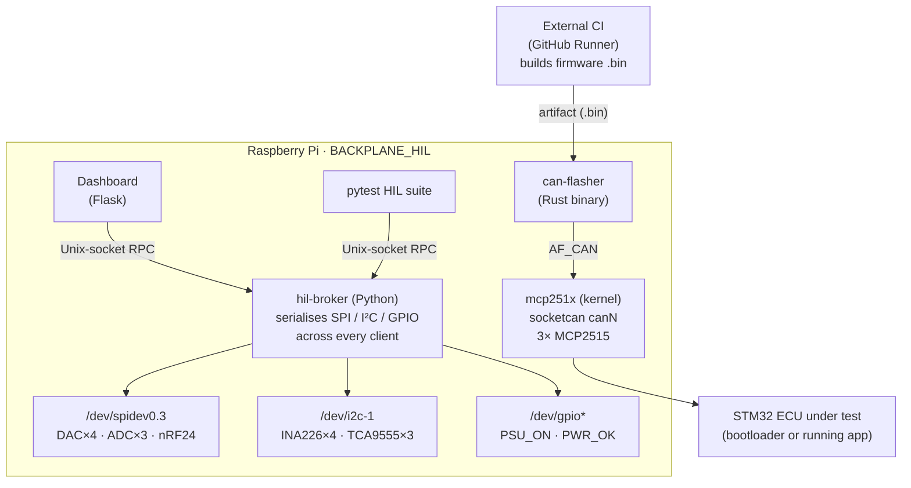

# IFS08_HIL — Hardware-in-the-Loop testbench

Automated STM32 ECU firmware validation on a Raspberry Pi. The bench
orchestrates reproducible Docker firmware builds, CAN-based flashing,
hardware simulation (DACs, ADCs, relays, power monitoring), and
pytest-driven regression. Designed for the Formula Student ECU suite
(VCU, AMS, MicroDV, Inverter) and wired through the BACKPLANE_HIL PCB.

---

## What the bench does

1. Receives a `/hil-build <subdir>` comment on an external firmware PR.
2. Clones the firmware repo, builds it in a pinned Docker image, uploads
   the `.bin` artifact.
3. Flashes the target ECU over CAN via the
   [`isc-fs/can-flasher`](https://github.com/isc-fs/can-flasher)
   bootloader protocol.
4. Runs the HIL pytest suite against the real hardware — injecting
   stimulus with DAC outputs, reading responses with ADCs and INA226
   power monitors, manipulating I/O via TCA9555 expanders and relays.
5. Posts 🟢 / 🔴 back to the originating firmware PR.

The bench itself is managed through a single
[`hil-broker`](broker/) process on the Pi — a mediator that owns SPI,
I²C, and GPIO, and exposes an RPC surface consumed by the dashboard,
the pytest fixtures, and (soon) the CI flash job. Clients do not
touch `/dev/*` directly.

---

## Architecture at a glance



---

## Getting started

- **In a hurry** — [`docs/quickstart.md`](docs/quickstart.md): the short path,
  a bootstrap script plus four manual steps, ~60-90 min including one reboot.
- **Fresh bench setup** — follow
  [`docs/getting-started.md`](docs/getting-started.md).
  From blank Pi OS to flashing an ECU in roughly 45 minutes.
- **Day-to-day operation** — see
  [`docs/operator-guide.md`](docs/operator-guide.md)
  for recipes: start/stop services, run the HIL suite, flash an ECU,
  view CAN traffic, recover from bus-off.
- **Hardware signal map** —
  [`docs/hardware-reference.md`](docs/hardware-reference.md)
  documents GPIO/I²C/SPI assignments, the CAN netdev ↔ PCB label
  inversion, MLC carrier wiring, and the PSU gating path.

---

## Repository layout

```
.
├── README.md                    you are here
├── pyproject.toml               Python package metadata and deps
├── broker/                      hil-broker: SPI/I²C/GPIO mediator
│   ├── server.py                Unix-socket JSON-RPC listener
│   ├── bus.py                   HardwareManager (real backend)
│   ├── fake_bus.py              In-memory backend for off-bench tests
│   └── rpc.py                   Method-table dispatcher
├── dashboard/                   Flask web UI, polls broker every 2 s
│   ├── app.py                   HTTP endpoints + poll loop
│   └── index.html               Dark-themed web UI
├── tools/                       Register-level chip drivers + helpers
│   ├── hw_config.py             Pin/address single source of truth
│   ├── hil_client.py            Client-side proxies (talk to broker)
│   ├── mcp3208.py  dac80504.py  ina226.py  tca9555.py  nrf24l01.py
│   ├── mcp2515.py               Legacy register-level CAN driver
│   └── flash.py                 Legacy Python flasher (deprecated)
├── tests/
│   ├── broker/                  Unit tests (fake backend, off-bench)
│   └── hil/                     HIL tests (broker proxies, on-bench)
├── docs/                        This folder — you are reading it
├── infra/
│   ├── devicetree/              mcp2515-triple.dts overlay source
│   ├── kernel-module/
│   │   └── mcp251x-patched/     Out-of-tree mcp251x module + patches
│   ├── systemd/                 hil-psu-on, hil-can-up, hil-broker units
│   ├── sudoers.d/               ip-link privilege drop-in
│   └── udev/                    USB device stable-naming rules
├── docker/                      Firmware build toolchain image
├── configs/                     Per-ECU YAML configs (VCU, AMS, ...)
├── scripts/                     bench_bootstrap.sh, sync_to_pi.sh,
│                                build_stm32_binaries.sh (launch.sh is
│                                accu-charger's, not ours)
└── .github/workflows/           CI: hil-build-trigger, hil-flash, …
```

The `firmware/` directory is intentionally empty; firmware sources
live in per-ECU repos and are pulled into the bench at CI time.

---

## Documentation index

**Onboarding**
- [`docs/getting-started.md`](docs/getting-started.md) — zero-to-flashing on a fresh Pi
- [`docs/operator-guide.md`](docs/operator-guide.md) — day-to-day recipes
- [`docs/troubleshooting.md`](docs/troubleshooting.md) — symptom → cause → fix

**Reference**
- [`docs/architecture.md`](docs/architecture.md) — component diagram and responsibilities
- [`docs/hardware-reference.md`](docs/hardware-reference.md) — PCB signals, GPIO / I²C / CAN mapping
- [`docs/broker-api.md`](docs/broker-api.md) — every broker RPC method
- [`docs/dashboard.md`](docs/dashboard.md) — HTTP endpoints and web UI

**Design history**
- [`docs/design/broker-migration.md`](docs/design/broker-migration.md) — why the broker exists, phase plan
- [`docs/design/mcp251x-driver-patches.md`](docs/design/mcp251x-driver-patches.md) — the five out-of-tree patches
- [`docs/design/phase-history.md`](docs/design/phase-history.md) — timeline with PR links

**Development**
- [`docs/development/setup.md`](docs/development/setup.md) — dev environment, branch policy
- [`docs/development/testing.md`](docs/development/testing.md) — broker tests, HIL tests, fake backend
- [`docs/development/kernel-module.md`](docs/development/kernel-module.md) — iterating on mcp251x

---

## License and contribution

Internal project for the ISC Racing Team Formula Student electronics
sub-system. Not licensed for external reuse without the team's
consent. Contributions from team members: see
[`docs/development/setup.md`](docs/development/setup.md) for the branch
and commit conventions.
