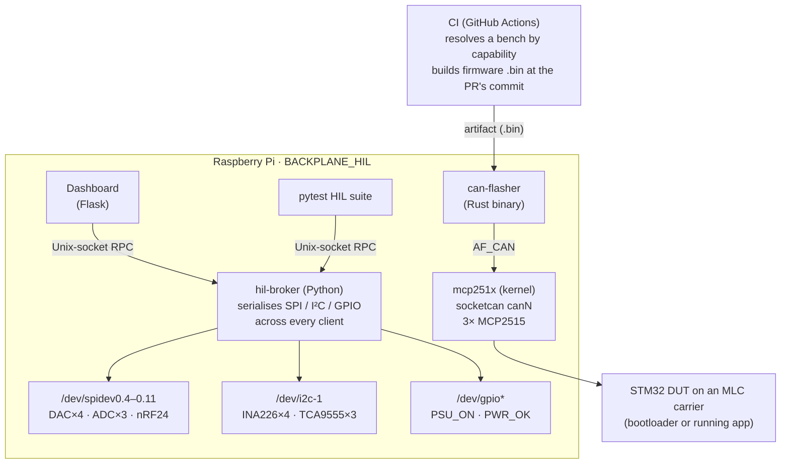

# IFS_HIL — Hardware-in-the-Loop testbench

A reusable hardware-in-the-loop platform for STM32 firmware, built on a
Raspberry Pi and the BACKPLANE_HIL PCB. A label on a firmware pull request
gets that exact commit built in the cloud, flashed over CAN onto a real
board, exercised by a pytest suite that drives its inputs and reads its
outputs, and judged — with the verdict posted back on the PR.

Nothing in the platform is tied to one car or one board. A device under
test (DUT) is described by a build recipe, a profile and a test suite; a
bench is described by the capabilities it physically has; CI matches the
two. Adding a new board is configuration plus tests, not a new bench.

**Taking the project over?** Start with [`HANDOVER.md`](HANDOVER.md).

---

## What the bench does

1. A firmware PR is labelled `hil-test`, or gets a `/hil-test [suite]`
   comment. The trigger is a small workflow in the firmware repo that
   dispatches this repo's [`hil-test.yml`](.github/workflows/hil-test.yml).
2. CI resolves the capabilities the run needs (`dut-*`, `stim-*`,
   `fault-*`) to a bench whose descriptor declares them and whose runner
   is online.
3. It checks the firmware out at the PR's exact commit and builds it from
   a recipe reviewed **in this repo** — never from the PR — then checks the
   image's flash layout before anything reaches hardware.
4. On the bench, the target carrier is isolated by slot and flashed over
   CAN via [`can-flasher`](https://github.com/isc-fs/MingoCAN) and the
   STM32 CAN bootloader.
5. The DUT's pytest suite runs against the real board — injecting stimulus
   with DACs and emulators, reading responses with ADCs, INA226 power
   monitors and CAN, switching I/O through TCA9555 expanders and relays.
6. The verdict, with a table of any failing cases, is commented on the
   originating PR.

All SPI / I²C / GPIO access on the Pi goes through one
[`hil-broker`](broker/) process, which serialises it for the dashboard,
the pytest fixtures and the flash wrapper
([`tools/flash_dut.py`](tools/flash_dut.py)). Clients never touch
`/dev/*` directly.

---

## Architecture at a glance


```mermaid
flowchart TD
    CI["CI (GitHub Actions)<br/>resolves a bench by capability<br/>builds firmware .bin at the PR's commit"]

    subgraph Pi["Raspberry Pi · BACKPLANE_HIL"]
        direction TB

        DASH["Dashboard<br/>(Flask)"]
        PYTEST["pytest HIL suite"]
        FLASH["can-flasher<br/>(Rust binary)"]

        BROKER["hil-broker (Python)<br/>serialises SPI / I²C / GPIO<br/>across every client"]

        SPI["/dev/spidev0.4–0.11<br/>DAC×4 · ADC×3 · nRF24"]
        I2C["/dev/i2c-1<br/>INA226×4 · TCA9555×3"]
        GPIO["/dev/gpio*<br/>PSU_ON · PWR_OK"]
        MCP["mcp251x (kernel)<br/>socketcan canN<br/>3× MCP2515"]

        DASH -- "Unix-socket RPC" --> BROKER
        PYTEST -- "Unix-socket RPC" --> BROKER
        FLASH -- "AF_CAN" --> MCP
        BROKER --> SPI
        BROKER --> I2C
        BROKER --> GPIO
    end

    CI -- "artifact (.bin)" --> FLASH
    MCP --> DUT["STM32 DUT on an MLC carrier<br/>(bootloader or running app)"]
```

---

## The generic model

| Concept | What it is | Where |
|---|---|---|
| **Bench** | One Pi + backplane. Its descriptor declares the capabilities it really has, its carrier slots, and its stimulus routing. CI routes runs by these. | [`configs/benches/`](configs/benches/) (validated by `schema.json`) |
| **Capability** | A label a run can require: `dut-<name>` (a carrier of that DUT is fitted), `stim-*` (a stimulus source is wired), `fault-*` (a fault can be injected). | `schema.json`, bench descriptors |
| **Firmware recipe** | How to build a DUT's firmware: repo, toolchain, configure/build commands, ELF path, mandatory flash-layout check. | [`configs/firmware/<dut>.yaml`](configs/firmware/) |
| **DUT profile** | How to talk to the board: bootloader node id, boot trigger, power-up timing, and the DUT-specific test constants. | a `*_profile.yaml` in the DUT's test dir, mapped in `tools/flash_dut.py` |
| **Suites** | Named subsets of a DUT's tests (`smoke`, `full`, …) a developer can request from the PR. | [`configs/suites.yaml`](configs/suites.yaml) |
| **Bench self-tests** | DUT-independent checks of the backplane itself (CAN, I²C, SPI DAC/ADC, relays, carrier power). | `tests/hil/test_*.py` |

### DUTs supported today

| DUT | Firmware repo | Tests | Notes |
|---|---|---|---|
| `ams` — accumulator management system | `isc-fs/IFS08-CE-AMS` | [`tests/hil/ams/`](tests/hil/ams/) | Cell and temperature stimulus from a Pico-based LTC6811 chain emulator ([`docs/pico_ltc_emulator.md`](docs/pico_ltc_emulator.md)). |
| `ecu` — vehicle control unit | `isc-fs/IFS08-CE-ECU` | [`tests/hil/vcu/`](tests/hil/vcu/) | Inverter and AMS traffic simulated on CAN. The directory is `vcu` for historical reasons. |
| `udv` — micro-DV | `isc-fs/IFS08-DV-uDV` | — | Capability reserved and trigger wired; no recipe or suite yet. |

### Adding a DUT

1. **Recipe** — add `configs/firmware/<dut>.yaml`. The app must link for
   the bootloader's app slot; the recipe's `layout_check` enforces it.
2. **Profile and tests** — add a `tests/hil/<dir>/` suite with a
   `*_profile.yaml`, and register the profile in `PROFILE_FOR_DUT` in
   [`tools/flash_dut.py`](tools/flash_dut.py).
3. **Capability** — add `dut-<dut>` (and the slot `dut` value) to
   [`configs/benches/schema.json`](configs/benches/schema.json), and
   declare it on every bench that has the board fitted.
4. **Suites** — give it at least a `smoke` entry in
   [`configs/suites.yaml`](configs/suites.yaml).
5. **Trigger** — add the `hil-test.yml` trigger workflow to the firmware
   repo's default branch and share the `HIL` org secret with that repo.
   See [`docs/development/testing.md`](docs/development/testing.md#running-a-suite-from-a-firmware-pr).

The board itself needs the STM32 CAN bootloader
(`isc-fs/stm32-can-bootloader`) burned over SWD, with its node id
provisioned, before a bench can flash it.

---

## Getting started

- **Taking the project over** — [`HANDOVER.md`](HANDOVER.md): current
  state, how CI works, what is fragile, and first tasks.
- **In a hurry** — [`docs/quickstart.md`](docs/quickstart.md).
- **Fresh bench** — run [`scripts/bench_setup.sh`](scripts/bench_setup.sh)
  (resumable; it stops once for a reboot), or follow
  [`docs/getting-started.md`](docs/getting-started.md), the
  explain-every-step version.
- **Day-to-day operation** —
  [`docs/operator-guide.md`](docs/operator-guide.md): services, running
  suites, flashing, CAN traffic, recovering a wedged bench.
- **Testing a firmware PR** — label it `hil-test` (or comment
  `/hil-test [suite]`):
  [`docs/development/testing.md`](docs/development/testing.md#running-a-suite-from-a-firmware-pr).
- **Hardware signal map** —
  [`docs/hardware-reference.md`](docs/hardware-reference.md): GPIO / I²C /
  SPI assignments, the CAN netdev ↔ PCB label inversion, carrier wiring,
  PSU gating.

---

## Repository layout

```
.
├── README.md                    you are here
├── HANDOVER.md                  maintainer handover: state, risks, first tasks
├── CLAUDE.md                    operator cheat-sheet, invariants, branch policy
├── pyproject.toml               Python package metadata and deps
├── broker/                      hil-broker: SPI/I²C/GPIO mediator
│   ├── server.py                Unix-socket JSON-RPC listener
│   ├── bus.py                   HardwareManager (real backend)
│   ├── fake_bus.py              In-memory backend for off-bench tests
│   └── rpc.py                   Method-table dispatcher
├── dashboard/                   Flask web UI on :8080
├── tools/
│   ├── hw_config.py             Pin/address single source of truth
│   ├── hil_client.py            Client-side proxies (talk to broker)
│   ├── bench.py                 Fleet CLI: descriptors, suites, doctor, recover
│   ├── flash_dut.py             Flash a DUT safely (what CI runs)
│   ├── firmware_test/           Per-DUT CAN maps, simulators, observers
│   ├── pico_ltc_emulator/       Pico firmware emulating an LTC6811 chain
│   ├── mcp3208.py  dac80504.py  ina226.py  tca9555.py  nrf24l01.py
│   └── flash.py  mcp2515.py     Legacy (deprecated)
├── tests/
│   ├── test_*.py                Host-only tests (no bench needed)
│   ├── broker/                  Broker tests on the fake backend
│   └── hil/                     On-bench: self-tests + one dir per DUT suite
├── configs/
│   ├── benches/                 Bench capability descriptors + schema
│   ├── firmware/                Per-DUT build recipes
│   ├── suites.yaml              Named suites per DUT
│   └── ecu_*.yaml  hil_agent.yaml   Legacy (old CI chain)
├── infra/
│   ├── devicetree/              mcp2515-triple.dts overlay source
│   ├── kernel-module/           Patched out-of-tree mcp251x
│   ├── systemd/                 hil-* units, watchdog timer, runner drop-in
│   ├── sudoers.d/               ip-link privilege drop-in
│   └── udev/                    Device naming rules
├── docker/                      Firmware build image (legacy CI chain only)
├── scripts/                     bench_setup.sh (new bench, start here),
│                                sync_to_pi.sh, build_stm32_binaries.sh
├── docs/                        Guides, reference, design history
└── .github/workflows/           hil-test (+ hil-fw-build), host-tests,
                                 bench-inventory; hil-build-*/hil-flash = legacy
```

`firmware/` is intentionally empty: firmware lives in each DUT's own repo
and CI checks it out at the exact commit under test.

Host-only checks run anywhere with Python 3.11 on Linux:

```sh
pip install -e .
python -m pytest tests/ --ignore=tests/hil -q
```

---

## Documentation index

**Onboarding**
- [`HANDOVER.md`](HANDOVER.md) — start here if you are taking the project over
- [`docs/quickstart.md`](docs/quickstart.md) — the short path to a working bench
- [`docs/getting-started.md`](docs/getting-started.md) — zero-to-flashing on a fresh Pi
- [`docs/operator-guide.md`](docs/operator-guide.md) — day-to-day recipes
- [`docs/troubleshooting.md`](docs/troubleshooting.md) — symptom → cause → fix

**Reference**
- [`docs/architecture.md`](docs/architecture.md) — component diagram, CI chain, capability routing
- [`docs/hardware-reference.md`](docs/hardware-reference.md) — PCB signals, GPIO / I²C / SPI / CAN mapping
- [`docs/broker-api.md`](docs/broker-api.md) — every broker RPC method
- [`docs/dashboard.md`](docs/dashboard.md) — HTTP endpoints and web UI
- [`docs/pico_ltc_emulator.md`](docs/pico_ltc_emulator.md) — the Pico LTC6811 chain emulator
- [`infra/systemd/README.md`](infra/systemd/README.md) — every systemd unit, and the runner drop-in

**Design history**
- [`docs/design/broker-migration.md`](docs/design/broker-migration.md) — why the broker exists, phase plan
- [`docs/design/mcp251x-driver-patches.md`](docs/design/mcp251x-driver-patches.md) — the five out-of-tree patches
- [`docs/design/phase-history.md`](docs/design/phase-history.md) — timeline with PR links

**Development**
- [`docs/development/setup.md`](docs/development/setup.md) — dev environment, branch policy
- [`docs/development/testing.md`](docs/development/testing.md) — broker tests, HIL tests, fake backend, suites from a PR
- [`docs/development/kernel-module.md`](docs/development/kernel-module.md) — iterating on mcp251x

---

## License and contribution

Maintained by the ISC Racing Team (Formula Student) electronics group.
Not licensed for external reuse without the team's consent. Contributors:
see [`docs/development/setup.md`](docs/development/setup.md) for the branch
and commit conventions.
