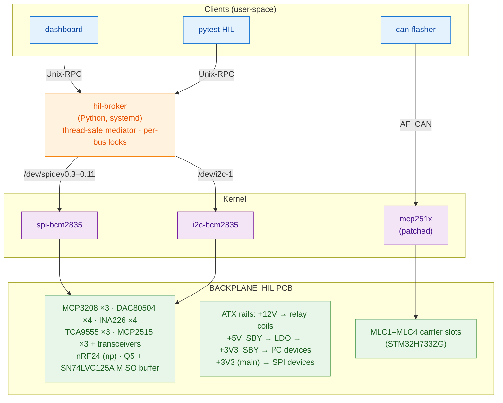
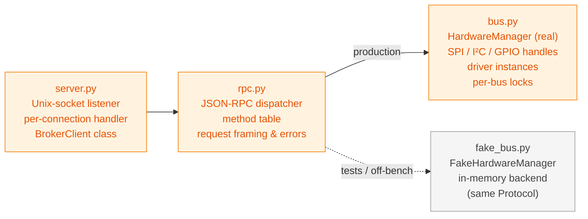
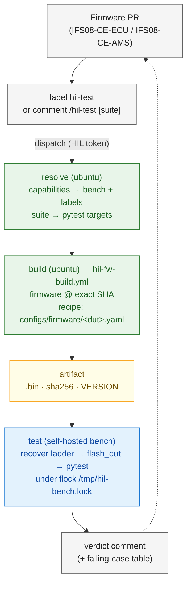

# Architecture

A top-down tour of the HIL bench. Read this once when you join the
project; return for component responsibility questions later.

Pair with [`hardware-reference.md`](hardware-reference.md) for the
signal-level details and
[`design/broker-migration.md`](design/broker-migration.md) for the
"how did we get here" history. Taking the project over? Start with
[`HANDOVER.md`](../HANDOVER.md).

---

## One-paragraph summary

The HIL bench is a Raspberry Pi 4 plugged into a custom backplane
PCB (BACKPLANE_HIL) that hosts three CAN controllers, four MLC
carrier slots (each with an STM32 ECU, an INA226 power monitor, and
a relay), three TCA9555 I/O expanders, four DAC80504s, three
MCP3208s, and an ATX PSU interface. Kernel `mcp251x` (patched
out-of-tree) drives the CAN chips and exposes them as SocketCAN
`canN` netdevs. A Python daemon — `hil-broker` — is the single
owner of SPI, I²C, and GPIO; it serialises hardware access across
the rest of the stack (a Flask dashboard, the pytest HIL suite, and
an RPC helper library that tests use via `from tools.hil_client
import …`). CAN flashing is done by the separate Rust
`can-flasher` binary, which talks to `canN` directly via SocketCAN.
A set of systemd units (`hil-psu-on`, `hil-can-up`, `hil-broker`,
`hil-dashboard`, and the `hil-bench-watchdog` timer) brings the bench
into a known state on every boot and keeps it there. Firmware PRs
reach a bench through a capability-routed GitHub Actions chain that
builds in the cloud, then flashes and tests on the bench's
self-hosted runner.

---

## Layered view

---

## Components and responsibilities

### Hardware layer — BACKPLANE_HIL PCB

Single-board backplane with:

- Three MCP2515 + SN65HVD230 CAN channels. PCB CAN1 is wired to
  the MLC carrier bus (where the ECUs under test live); PCB CAN2
  and CAN3 are available for future use (e.g. simulating a second
  vehicle subsystem).
- Four MLC carrier slots. Each carrier is a separate daughter
  board with an STM32H733ZG. The carrier connects to +12V via a
  relay coil (K1–K4) and to the MLC-bus CAN1 transceiver.
- Four INA226 current monitors, one per MLC slot, low-side
  sensing (so `bus_voltage()` reads ~0 V by design).
- Three TCA9555 I/O expanders on I²C. TCA0 (`0x20`) port 0 bits
  0–3 drive the Q1–Q4 NMOSFETs that energise the K1–K4 relay coils.
- Three MCP3208 8-channel ADCs and four DAC80504 4-channel DACs
  for analog stimulus / response, sharing SPI0 with the CAN
  controllers, each behind its own kernel-managed chip-select.
- SN74LVC125A tri-state buffer on the SPI data lines (MOSI, MISO,
  SCK); its `~OE` is gated by ATX `PWR_OK` through a small-signal
  NMOS (Q5). The SPI bus to every peripheral is therefore silent
  when the ATX PSU is off — a feature, not a bug.
- ATX PSU control: `PS_ON#` out on GPIO7, `PWR_OK` in on GPIO8.

Full signal map in [`hardware-reference.md`](hardware-reference.md).

### Kernel layer

- **`spi-bcm2835`** — stock Raspberry Pi SPI0 master driver.
- **`mcp251x`** — **patched** out-of-tree build in
  [`infra/kernel-module/mcp251x-patched/`](../infra/kernel-module/mcp251x-patched/).
  The stock driver can't probe on this board because of three
  hardware quirks around single-burst SPI reads, the RESET
  instruction, and a CANCTRL read-back register. Five targeted
  patches fix those; see
  [`design/mcp251x-driver-patches.md`](design/mcp251x-driver-patches.md).
- **`i2c-bcm2835`** — stock I²C driver for `/dev/i2c-1`.
- **`can-dev` + `can-raw`** — SocketCAN kernel layer. The kernel
  brings up `can0` / `can1` / `can2` from the three `mcp251x`
  devices.
- **Device-tree overlay** at
  [`infra/devicetree/mcp2515-triple.dts`](../infra/devicetree/mcp2515-triple.dts)
  binds all three MCP2515s (SPI mode 3, a 16 MHz fixed-clock node,
  interrupts on GPIO4/5/6) and declares **all twelve SPI0
  chip-selects as `cs-gpios`**: the CAN chips on `spi0.0`–`0.2`, and
  spidev nodes for the DACs (`spidev0.4`–`0.7`, mode 1), the ADCs
  (`0.8`–`0.10`, mode 0) and the nRF24 (`0.11`), plus the legacy
  shared `spidev0.3` on the unused GPIO16. Because the SPI core now
  asserts every chip-select *inside* the transfer, under the
  controller lock, a DAC can no longer be selected while `mcp251x`
  clocks out a CAN message — the race behind the DAC wedges of
  #124. It leaves GPIO7/8 alone for our PSU control.

### System services

The units live in [`infra/systemd/`](../infra/systemd/) (install
notes in its [README](../infra/systemd/README.md)), in dependency
order:

1. **`hil-psu-on.service`** — oneshot at `sysinit.target`,
   re-asserts `PS_ON#` (GPIO7) low and forces GPIO8 back to
   input+pull-down. Compensates for the Pi 4's GPIO output-state
   persistence across reboots (a prior userspace toggle can defeat
   the firmware `gpio=7=op,dl` directive).
2. **`hil-can-up.service`** — oneshot; runs `ip link set canN up
   type can bitrate 500000 sample-point 0.6875 restart-ms 200` and
   `txqueuelen 1000` on all three interfaces, then fails the unit if
   the sample point didn't take (0.875 vs 0.6875 is a bus-off trap).
   The `txqueuelen=1000` is required to sustain a full-speed flash
   write (default 10 overflows).
3. **`hil-broker.service`** — `simple` long-running; exec-starts
   `python3 -m broker.server --socket /run/hil-broker/broker.sock`
   as the `isc` user, with the sudoers drop-in at
   [`infra/sudoers.d/hil-broker`](../infra/sudoers.d/hil-broker)
   granting narrow `ip link set canN …` escalation.
4. **`hil-dashboard.service`** — the Flask UI on `:8080`; a broker
   client that `Wants=` (not `Requires=`) the broker, so it renders
   red panels rather than dying when the broker does.
5. **`hil-bench-watchdog.timer`** → **`.service`** — every 5 min runs
   `python3 -m tools.bench watchdog`: verify the bench and, if it is
   wedged, climb the recover ladder (L1 restart `hil-broker`; L2 PSU
   power-on reset + reload `mcp251x` + restart `hil-can-up` and
   `hil-broker`). It takes the bench lock non-blocking, so it never
   recovers mid-flash, and reports `RUNNER DOWN` when the runner
   service isn't active. The timer is what must be enabled — the
   service alone never fires.

On a bench that takes CI runs, the GitHub Actions runner's own unit
(generated by its `svc.sh`) gets the
[`actions.runner.restart.conf`](../infra/systemd/actions.runner.restart.conf)
drop-in (`Restart=always`), because the stock unit never restarts a
runner that exits. `hil-agent.service` ships in the directory but is
deliberately not installed — it belongs to a retired design.

### `hil-broker` — the mediator

The broker is the single owner of SPI/I²C/GPIO on the Pi. Its job
is to serialise every hardware access across clients so
the dashboard, the test suite, and any ad-hoc scripts don't
corrupt each other's transactions.

Structure:

Concurrency:

- One `threading.Lock` each for the SPI bus, the I²C bus, the
  GPIO subsystem, and the CAN link-state changes.
- Each incoming RPC acquires the lock for the underlying bus and
  releases it when the driver call returns. Operations on
  **different** buses (e.g. SPI DAC write and I²C INA226 read)
  run in parallel. Operations on the **same** bus serialise.
- The broker is multi-threaded (one thread per connected client),
  but there are at most three concurrent clients in practice
  (dashboard, optionally a test run, optionally an ad-hoc shell).

Full method table in [`broker-api.md`](broker-api.md).

### Clients

Three consumers talk to the broker. None of them should open
`/dev/spidev*`, `/dev/i2c-*`, or `/dev/gpiochip*` directly —
that's the whole point of the mediator.

**Dashboard** — [`dashboard/app.py`](../dashboard/app.py)

- Flask web server on port 8080.
- One background thread polls the broker every 2 s for all
  sensors, caches the result in memory, serves `/api/status` from
  the cache (so page loads never wait on hardware).
- Control endpoints (`/api/psu/power`, `/api/dac/…`, etc.) are
  RPC passthroughs with input validation.
- See [`dashboard.md`](dashboard.md) for the HTTP API.

**HIL pytest suite** — [`tests/hil/`](../tests/hil/)

- Fixtures construct client proxies from
  `tools.hil_client.MCP3208(idx=N)` etc. Each proxy call translates
  to a broker RPC.
- Tests auto-skip if the broker socket isn't reachable, so an
  off-bench `pytest tests/` doesn't error out.
- The unit-test counterpart at [`tests/broker/`](../tests/broker/)
  exercises the dispatcher and fake backend without touching any
  real hardware.

**`can-flasher`** — the Rust binary from
[isc-fs/MingoCAN](https://github.com/isc-fs/MingoCAN)

- Does **not** go through the broker. Binds directly to the
  SocketCAN netdev `can2`.
- Rationale: the broker's job is to serialise SPI and I²C, which
  the flasher doesn't touch; SocketCAN is already multi-client
  through the kernel. Keeping the flasher transport-independent
  also means it's trivially usable with other adapters (CANable
  via SLCAN, PCAN on Windows, etc.) with no broker in the loop.
- In CI it is driven by [`tools/flash_dut.py`](../tools/flash_dut.py),
  which uses the broker only for carrier power and current, and
  shells out to `can-flasher` for the transfer itself.

### Bench fleet and capability routing

A bench is described by a committed descriptor,
[`configs/benches/<id>.yaml`](../configs/benches/) (schema:
[`schema.json`](../configs/benches/schema.json)). Three parts matter:

- **`capabilities`** — what the bench can *do*, in a fixed
  vocabulary: `dut-*` (the carriers it seats: `ams`, `ecu`, `udv`),
  `stim-*` (stimulus it can inject), `fault-*` (faults it can
  create), `radio-*`. These **route** work.
- **`hardware`** — what provides each capability. Documentation
  only, never routed on, so swapping a fixture doesn't change what
  tests ask for.
- **`expect`** — the probe-verifiable half (INA / TCA addresses,
  DACs, nRF24), which `tools.bench verify` diffs against the live
  bench.

A bench's runner is registered with the labels `self-hosted,
hil-bench, <bench-id>, <capabilities…>` (from `tools.bench labels`),
so GitHub's own runner matching *is* the routing table.
[`tools/bench.py`](../tools/bench.py) is the fleet CLI: `validate`,
`list`, `labels`, `resolve` and `suite` work offline (CI uses them);
`describe`, `verify`, `doctor`, `recover` and `watchdog` run on the
bench.

### CI/CD loop

The trigger is each firmware repo's own `hil-test.yml`; it dispatches
[`.github/workflows/hil-test.yml`](../.github/workflows/hil-test.yml)
here using the org secret `HIL`. Then:

- **`resolve`** runs `tools.bench resolve` against the committed
  descriptors (the cloud runner has no bench access, which is why
  descriptors live in the repo), confirms a runner carrying the
  labels is online, and expands the suite from
  [`configs/suites.yaml`](../configs/suites.yaml) (none = `smoke`).
- **`build`**
  ([`hil-fw-build.yml`](../.github/workflows/hil-fw-build.yml))
  checks the firmware out at the exact SHA and builds it from the
  recipe reviewed *in this repo*, never from the PR — pinned
  toolchain, plus a flash-layout gate that refuses an image not
  linked at the application address. If the artifact upload fails
  (free-plan quota), the test job rebuilds the same commit on the
  bench instead.
- **`test`** runs on the matched bench. A per-bench `concurrency`
  group queues runs, and a `flock` on `/tmp/hil-bench.lock` also
  covers anyone on the bench over SSH who takes the same lock, and
  makes the watchdog stand down. `tools/flash_dut.py` isolates the
  target carrier, flashes, and gates on the bootloader's identity;
  pytest then runs the suite against the same image, and the verdict
  is commented back on the PR (via `HIL_CROSS_REPO_PAT`).

Two supporting workflows run in the cloud with no bench:
`host-tests.yml` (whole-tree collection plus the host-only suites)
and `bench-inventory.yml` (descriptor validation).

The older `/hil-build` chain (`hil-build-trigger.yml` →
`hil-build-only.yml` → `hil-flash.yml`, Docker image, runner label
`hil-rpi`) is still in the directory but dead: no runner carries its
label. It is slated for removal.

---

## Important invariants

A few things the whole system relies on. If any of these breaks,
expect weird failures:

1. **The broker is the only opener of `/dev/spidev0.3`–`0.11`,
   `/dev/i2c-1` and `/dev/gpio*`.** If something else holds one of
   these open, you will see intermittent bus corruption under load.
2. **The kernel owns every SPI chip-select.** The `mcp251x` driver
   owns `spi0.0`, `spi0.1`, `spi0.2` — do not try to open
   `/dev/spidev0.0/1/2`; they don't exist when the overlay is loaded,
   and trying will wedge things if the overlay is ever removed. The
   SPI core asserts the other nine chip-selects; never toggle one as
   a GPIO from userspace (that reopens the #124 race).
3. **CAN netdev ↔ PCB label is inverted** (`can0` = CAN3,
   `can2` = CAN1). Don't try to "fix" this in software — it's a
   property of the kernel's probe order on this board and changing
   the overlay's `reg` numbers would just swap the kernel name
   mapping, breaking every doc and script that already assumes
   `can2 = CAN1`.
4. **Firmware `gpio=7=op,dl` must be in `/boot/firmware/config.txt`.**
   Without it, the kernel probes `mcp251x` before the PSU is on,
   and the probe fails. `hil-psu-on.service` is a belt-and-braces
   re-assertion, not a substitute.
5. **`txqueuelen` on `canN` must be > 10**, or sustained flashes
   hit ENOBUFS. `hil-can-up.service` sets 1000.

---

## Related documents

- [`HANDOVER.md`](../HANDOVER.md) — current state, risks, first tasks.
- [`hardware-reference.md`](hardware-reference.md) — signal map.
- [`broker-api.md`](broker-api.md) — every RPC method.
- [`dashboard.md`](dashboard.md) — HTTP API.
- [`infra/systemd/README.md`](../infra/systemd/README.md) — every unit,
  and the runner drop-in.
- [`development/testing.md`](development/testing.md) — suites, and
  running one from a firmware PR.
- [`design/broker-migration.md`](design/broker-migration.md) —
  the phased plan that got us here.
- [`design/mcp251x-driver-patches.md`](design/mcp251x-driver-patches.md) —
  why the kernel module is patched and what each patch does.
- [`design/phase-history.md`](design/phase-history.md) — timeline
  of migrations with PR links.
