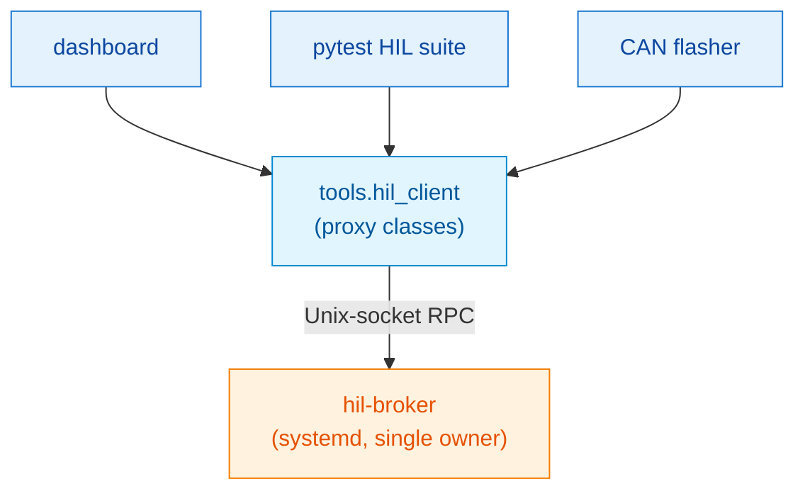

# The broker migration — plan, reality, and retrospect

This document captures both the original design plan for the
`hil-broker` mediator and how Phases 0–4 actually played out. It
supersedes the pre-implementation `docs/broker_migration_plan.md`.

---

## Why the broker exists

Before Phase 0, every process that wanted bench hardware opened
`/dev/spidev*`, `/dev/i2c-*`, and `/dev/gpio*` directly. The
dashboard, the pytest suite, and a prospective CAN flasher all
wanted access concurrently. There was no arbitration, and the
symptoms showed: back-to-back SPI bursts through the SN74LVC125A
buffer corrupted DAC80504 shadow registers, the operational rule
was *"never run scripts while the dashboard is up"*, and the CI
flash job and dashboard poll loop would have collided by design.

The fix wasn't more locks in each script — it was one process
that owns the buses and everyone else talks to it. That's the
broker.

---

## Original plan (for the record)

- **Scope**: single long-lived process, owns SPI / I²C / GPIO,
  exposes a Unix-socket JSON-RPC.
- **Non-goals**: no Docker on the Pi, no microservice mesh, no
  replacement of `tools/*.py` driver internals — the broker wraps
  them.
- **Transport**: Unix domain socket, line-delimited JSON. Stdlib
  only. Rejected gRPC, ZeroMQ, HTTP/localhost as overkill.

Target layering:

Phases, as originally planned:

| # | Goal |
|---|---|
| 0 | `tools/hil_client.py` seam — re-exports today's drivers, flip internals later. |
| 1 | Broker skeleton: server, RPC dispatcher, fake backend, unit tests. |
| 2 | Cut dashboard over; delete direct hardware access from `dashboard/app.py`. |
| 3 | Cut pytest over; delete the "don't run tests while the dashboard is up" warning. |
| 4 | CAN flasher as a broker-native client. |
| 5 | Observability — metrics, broker panel, logs. |

---

## What actually shipped

**Phase 0 — seam.** `tools/hil_client.py` introduced as a thin
re-export stub; no behaviour change. Seam in place for Phase 2 to
flip.

**Phase 1 — broker skeleton.** Server (`broker/server.py`), RPC
dispatcher (`broker/rpc.py`), real backend (`broker/bus.py`), fake
backend (`broker/fake_bus.py`), 14 unit tests via fake backend
(`tests/broker/`), systemd unit (`infra/systemd/hil-broker.service`).
Unit socket defaults to `/run/hil-broker/broker.sock`. No client
migrated yet; everything additive.

**Phase 2 — dashboard cutover.** `tools/hil_client.py` internals
flipped from re-exports to proxy classes that RPC the broker.
Dashboard's `_init_hardware()` and `_hw_lock` both deleted. Verified
on the bench with `/proc/<pid>/fd` that the broker process was the
sole holder of `/dev/spidev0.0`, `/dev/i2c-1`, `/dev/gpiomem`.

**Phase 3 — pytest cutover.** `tests/hil/conftest.py` rewritten to
return broker proxies. The "never run tests while the dashboard is
up" rule went away; `pytest tests/hil/` and the live dashboard now
coexist. 93 passed / 11 skipped.

**Phase 4 — CAN flasher integration.** Here's where the plan
changed shape.

The original plan said *"adapt the flasher to route MCP2515 access
through the broker"*. That assumed the flasher was something we
owned and could easily modify. When we actually looked at
[isc-fs/MingoCAN](https://github.com/isc-fs/MingoCAN), it
turned out to be a Rust binary that speaks only SocketCAN, SLCAN,
PCAN, or a virtual backend — with no pluggable broker transport.

Two paths forward: (a) wrap the flasher in a broker shim, or
(b) move the CAN chips to the kernel's `mcp251x` driver so the
flasher's SocketCAN path works directly. We went with (b) because
the kernel driver is the standard, well-trodden abstraction and
the flasher remains transport-independent.

What that required turned out to be meaningful:

- A custom device-tree overlay
  ([`infra/devicetree/mcp2515-triple.dts`](../../infra/devicetree/mcp2515-triple.dts))
  because none of the stock Pi overlays cover three MCP2515s on
  custom CS pins with the PCB's IRQ routing.
- **Five out-of-tree patches to the `mcp251x` kernel module** to
  work around three hardware quirks on this board. Full write-up
  in [`mcp251x-driver-patches.md`](mcp251x-driver-patches.md).
- A rewrite of the broker's CAN backend from the register-level
  `tools/mcp2515.py` to `python-can` over SocketCAN + `ip link`
  for state management, while preserving the same RPC surface so
  dashboard and tests kept working.
- A sudoers drop-in and a `hil-can-up.service` unit for bench
  bring-up.
- A single-line change to the `can-flasher` release CI to publish
  an `aarch64-unknown-linux-gnu` binary; shipped as v1.1.2.

Net result: the flasher binary-installs on the Pi, binds to
SocketCAN directly, and flashes an ECU end-to-end. The broker
*does not* participate in the flash data path — it just owns the
surrounding environment (PSU, carrier relays, sensors).

**Phase 5 — not yet shipped.** See the tentative scope in
[the operator guide](../operator-guide.md) and the phase history.

---

## What we got right

- **The broker as a mediator was the right call.** The
  "don't run scripts while the dashboard is up" rule was a real
  bug, not an artefact, and the mediator pattern killed it
  permanently. The bench now supports concurrent dashboard +
  tests + ad-hoc shell + CI with zero contention.
- **Preserve the RPC surface across backend swaps.** The CAN
  backend switch from register-level SPI to SocketCAN happened
  with no dashboard or test changes. That's the whole point of
  an API boundary.
- **Fake backend from day one.** `broker/fake_bus.py` let every
  PR between Phase 0 and Phase 4 get unit-test coverage off-bench.
  15/15 tests pass on a Mac with no hardware.
- **Conservative IPC choice.** Unix socket + line-delimited JSON
  has been trouble-free. No tooling cost, no serialisation
  arguments.
- **Per-bus locks, not a single monolithic lock.** Concurrent
  operations on different buses parallelise; only the same-bus
  ones serialise. Good for latency, good for throughput.

---

## What we got wrong, or learned the hard way

- **The original Phase 4 was fundamentally mis-scoped.** Thinking
  the flasher could be "routed through the broker" missed the
  reality that the flasher is transport-agnostic by design and
  wants a standard CAN interface, not a custom RPC. The right move
  was to give it one. Phase 4 as it shipped is arguably a
  "Phase 4-prime" — kernel socketcan adoption + flasher binary
  install — rather than the original Phase 4 vision.
- **Hardware quirks on a custom PCB eat more days than you
  budget.** Three separate hardware-level issues combined to make
  stock `mcp251x` fail probe. The diagnosis chain (custom
  overlays, `ftrace` spi-transfer captures, write-known /
  read-back experiments) took longer than the actual
  implementation once we understood the failure modes.
- **The Pi 4 + 5VSBY combination produced misleading failure
  symptoms.** Undervoltage events corrupted SPI in ways that
  initially looked like driver bugs. Always start with
  `vcgencmd get_throttled` before blaming software.
- **GPIO output-state persistence across reboots is real on the Pi
  4.** The firmware `gpio=7=op,dl` directive is not sufficient on
  its own; `hil-psu-on.service` re-asserts at userspace boot.
- **Kernel netdev naming is unintuitive** (`can0` = PCB CAN3).
  Worth documenting prominently; we missed it during first-flash
  and it cost an operator session worth of confusion.

---

## Where the plan still holds

Phases 0–3 shipped close to the original plan. Phase 5 is still
open. The plan's Phase 5 scope was:

> - Broker exposes `/metrics` (bus op counts, latencies, error
>   rates).
> - Dashboard gains a "broker" panel showing queue depths and
>   last errors.
> - Log rotation via `journalctl` (already systemd-managed — no
>   extra config).

Updated scope, based on actual Phase 4 experience:

- **Tier 1 — ship this first**:
  1. Per-RPC-method metrics in the broker (counts, p50/p95
     latency, error counts). Groundwork already in place via
     `broker.health` → `op_count`.
  2. Dashboard "broker" panel: uptime, RPC throughput, last-N
     errors, per-CAN link state + counters.
  3. Flash-run audit log. Every `can-flasher` invocation
     recorded (timestamp, target, bin path, size, CRC, result,
     duration) — groundwork for CI gating.
- **Tier 2 — worth doing**:
  4. INA226 current-over-time chart per carrier.
  5. Staleness indicators (green / yellow / red for last-heard).
  6. `hil-dashboard.service` systemd unit (currently nohup'd).
- **Tier 3 — defer**:
  - Prometheus scrape (only if we actually pipe into Grafana).
  - Per-frame CAN recording (the flasher's `replay` covers it).

---

## Read these next

- [`mcp251x-driver-patches.md`](mcp251x-driver-patches.md) — the
  five patches and why each exists.
- [`phase-history.md`](phase-history.md) — PR-by-PR timeline.
- [`../architecture.md`](../architecture.md) — current state, not
  the plan.
